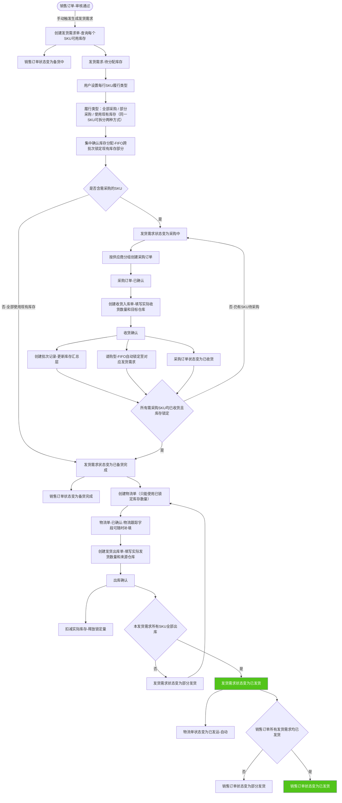
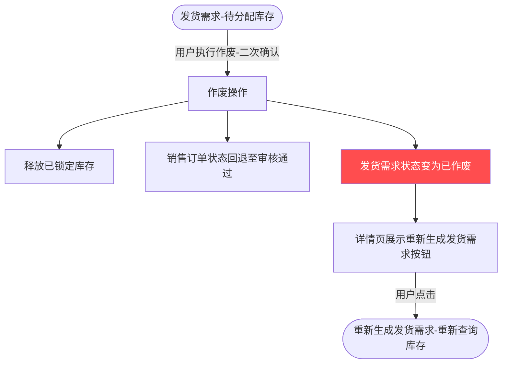
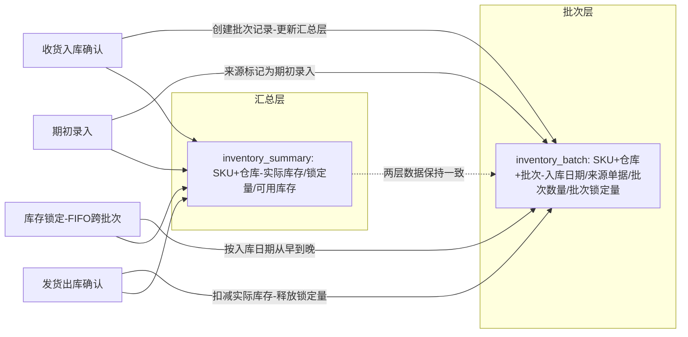

# 跨单据数据流与触发链图

> 生成日期：2026-04-26
> 覆盖范围：Epic 5–7 端到端业务闭环

---

## 完整触发链（Flowchart）

```mermaid
flowchart TD
    A([销售订单-审核通过]) -->|手动触发生成发货需求| B[创建发货需求单-查询每个SKU可用库存]
    B --> B1[销售订单状态变为备货中]
    B --> C[发货需求-待分配库存]

    C --> D[用户设置每行SKU履行类型]
    D --> D1["履行类型：全部采购 / 部分采购 / 使用现有库存（同一SKU可拆分两种方式）"]
    D1 --> E[集中确认库存分配-FIFO跨批次锁定现有库存部分]

    E --> F1{是否含需采购的SKU}
    F1 -->|否-全部使用现有库存| M[发货需求状态变为已备货完成]
    F1 -->|是| F[发货需求状态变为采购中]

    F --> H[按供应商分组创建采购订单]
    H --> I[采购订单-已确认]
    I --> J[创建收货入库单-填写实际收货数量和目标仓库]
    J --> K[收货确认]
    K --> K1[创建批次记录-更新库存汇总层]
    K --> K2[请购型-FIFO自动锁定至对应发货需求]
    K --> K3[采购订单状态变为已收货]
    K1 --> L{所有需采购SKU均已收货且库存锁定}
    K2 --> L
    K3 --> L

    L -->|是| M
    L -->|否-仍有SKU待采购| F

    M --> M1[销售订单状态变为备货完成]

    M --> N["创建物流单（只能使用已锁定库存数量）"]
    N --> O[物流单-已确认-物流跟踪字段可随时补填]
    O --> P[创建发货出库单-填写实际发货数量和来源仓库]
    P --> Q[出库确认]
    Q --> Q1[扣减实际库存-释放锁定量]
    Q --> Q2{本发货需求所有SKU全部出库}
    Q2 -->|否| R[发货需求状态变为部分发货]
    R --> N
    Q2 -->|是| S[发货需求状态变为已发货]
    S --> Q3[物流单状态变为已发运-自动]
    S --> T{销售订单所有发货需求均已发货}
    T -->|否| U[销售订单状态变为部分发货]
    T -->|是| V[销售订单状态变为已发货]

    style V fill:#52c41a,color:#fff
    style S fill:#52c41a,color:#fff
```

---

## 发货需求作废流程

```mermaid
flowchart TD
    A([发货需求-待分配库存]) -->|用户执行作废-二次确认| B[作废操作]
    B --> C[释放已锁定库存]
    B --> D[销售订单状态回退至审核通过]
    B --> E[发货需求状态变为已作废]
    E --> F[详情页展示重新生成发货需求按钮]
    F -->|用户点击| G([重新生成发货需求-重新查询库存])

    style E fill:#ff4d4f,color:#fff
```

---

## 库存双层结构说明

```mermaid
flowchart LR
    subgraph 汇总层
        S1[inventory_summary: SKU+仓库-实际库存/锁定量/可用库存]
    end
    subgraph 批次层
        B1[inventory_batch: SKU+仓库+批次-入库日期/来源单据/批次数量/批次锁定量]
    end

    IN1[收货入库确认] -->|创建批次记录-更新汇总层| B1
    IN1 --> S1
    IN2[期初录入] -->|来源标记为期初录入| B1
    IN2 --> S1
    LOCK[库存锁定-FIFO跨批次] -->|按入库日期从早到晚| B1
    LOCK --> S1
    OUT[发货出库确认] -->|扣减实际库存-释放锁定量| B1
    OUT --> S1

    S1 -.->|两层数据保持一致| B1
```
