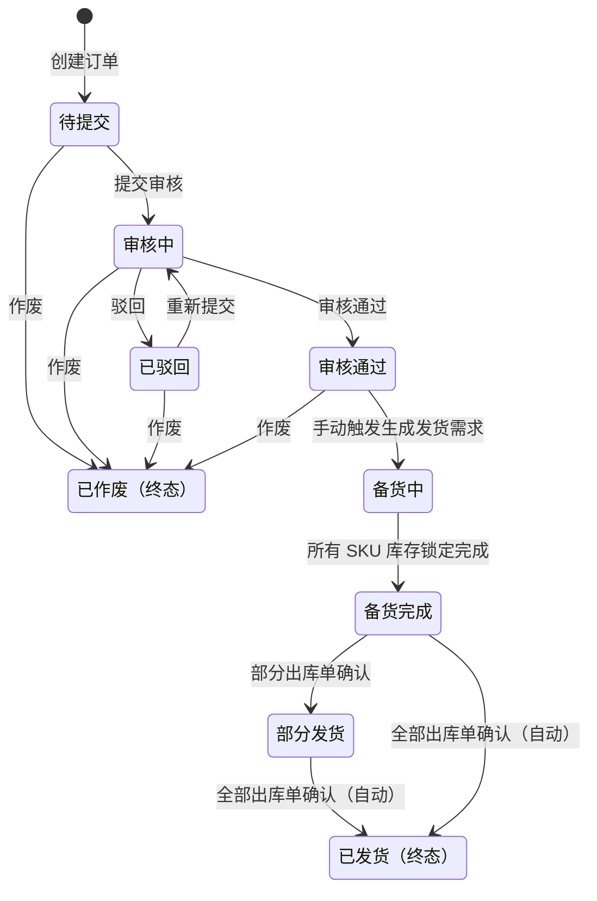
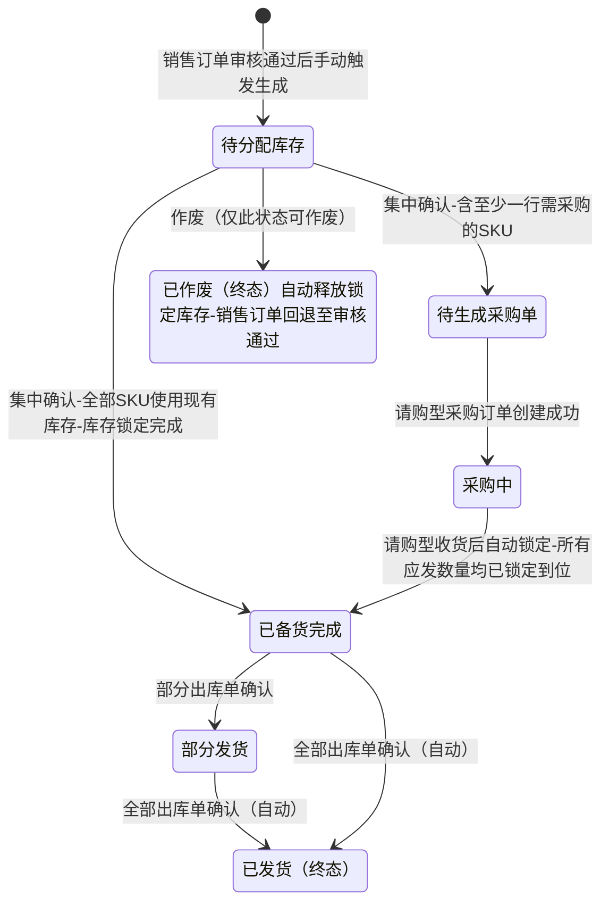
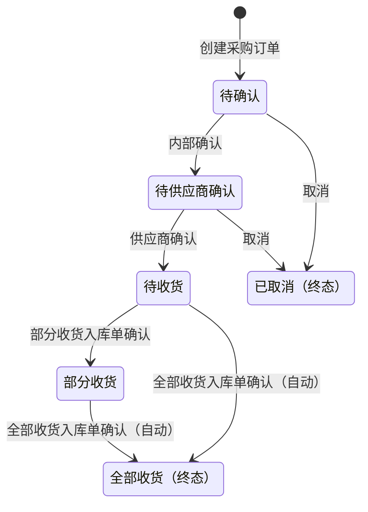
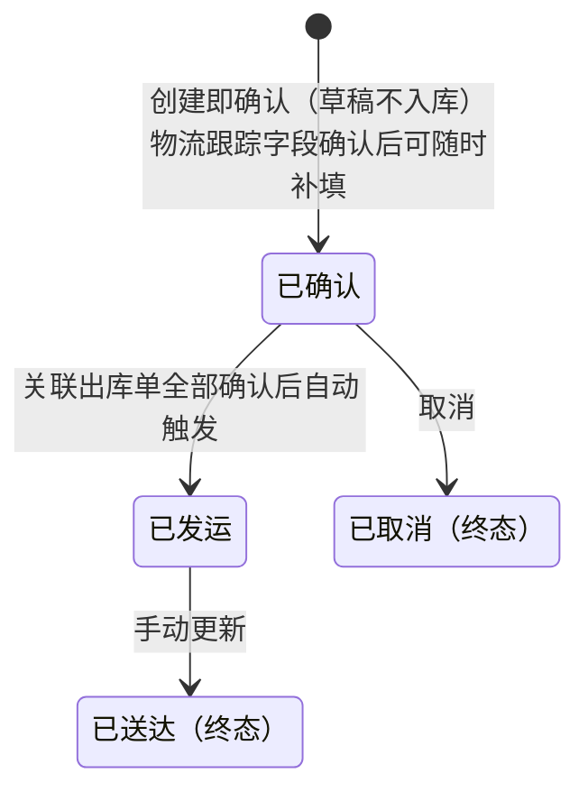

# 单据状态机图

> 生成日期：2026-04-26
> 最近修正：2026-04-29，依据 Sprint Change Proposal `sprint-change-proposal-2026-04-29.md` 为发货需求新增“待生成采购单”状态
> 覆盖范围：Epic 5–7 所有单据的状态流转

---

## 销售订单（SalesOrder）

---

## 发货需求（ShippingDemand）

> 说明：
> - 同一发货需求内，不同 SKU 明细行（甚至同一 SKU）可能同时存在"需要采购"和"使用现有库存"两种履行方式。
> - 状态只向前推进，不可逆。
> - 集中确认后，若所有 SKU 均使用现有库存，直接跳过"采购中"进入"已备货完成"。
> - 集中确认后，若有任一 SKU 需采购，先进入"待生成采购单"；采购订单创建成功后才进入"采购中"。
> - 每批请购型采购到货后 FIFO 自动锁定，直到所有应发数量全部锁定到位，推进至"已备货完成"。
> - 物流单只能使用已锁定的库存数量创建，因此出库数量与采购订单是否全部完成无关，状态由出库完成度决定。
> - 英文状态链：`pending_allocation` -> `pending_purchase_order` -> `purchasing` -> `prepared`。

---

## 采购订单（PurchaseOrder）

> 取消说明：采购订单取消后，发货需求状态**不回退**，仍停在"采购中"。对应 SKU 的缺口由用户从**发货需求详情页**复用"创建采购订单"入口补单，系统每次收货后继续触发 FIFO 锁定检查，直到全部锁定到位才推进至"已备货完成"。

---

## 物流单（LogisticsOrder）

---

## 发货出库单（OutboundOrder）

> 出库单无独立状态机，创建即为终态，确认后自动触发库存扣减和上游状态联动。
