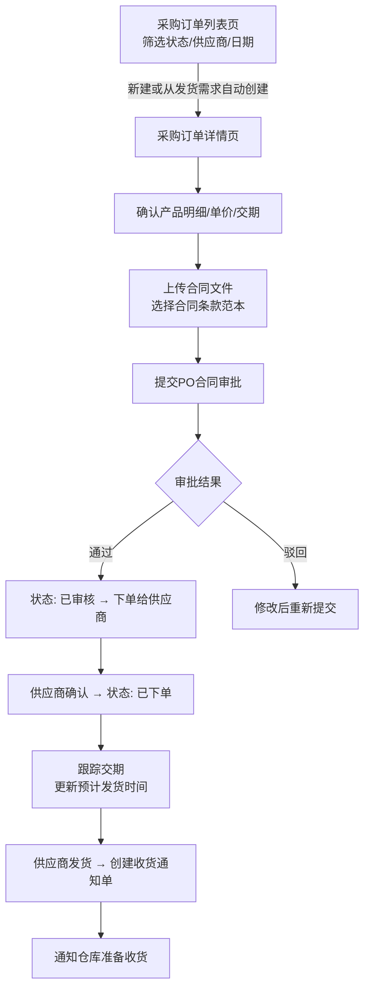
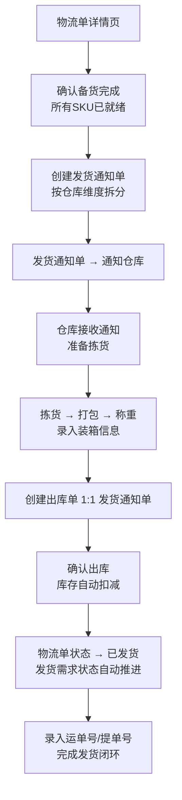

# UX Design Specification infitek_erp

**Author:** friday
**Date:** 2026-04-14

---

## Executive Summary

### Project Vision

infitek_erp 是星辰科技自主研发的新一代 ERP 系统，以"单一数据来源（Single Source of Truth）"原则取代当前宜搭低代码 + Excel 的碎片化数据流转。系统覆盖销售、商务、采购、仓储全链路，服务于一家专注科学仪器出海的贸易平台（160+ 国家、11,000+ SKU、18 家国内供应商）。

MVP 目标是建立 15 类核心主数据并打通简版交易链路（销售订单 -> 发货需求 -> 采购订单 -> 收货入库 -> 物流单 -> 发货出库），让业务团队在系统内完成完整的订单生命周期，彻底消除 Excel 和微信传递信息的依赖。

从 UX 角度，系统的核心价值主张是：**让每个角色在自己的工作场景中，用最少的操作步骤获取最完整的业务信息，做出最准确的决策**。

### Target Users

**主要用户群体（约 30+ 人业务团队）：**

| 角色 | 核心场景 | 使用频率 | 技术素养 | 关键痛点 |
|------|---------|---------|---------|---------|
| 销售员 | 录入订单、查看客户历史、跟踪发货状态 | 每日 | 中等 | CRM 签约后需手工导出补充信息到 ERP |
| 商务跟单 | 发货需求枢纽操作、协调采购与仓库、物流安排 | 每日高频 | 中等偏高 | 操作最密集的角色，需同时掌握多维信息 |
| 采购员/助理 | 供应商管理、采购订单、库存分配决策 | 每日 | 中等 | 供应商信息分散在 Excel 和同事记忆中 |
| 仓库人员 | 收货入库、发货出库、库存核对 | 每日 | 中低 | 依赖微信确认出入库信息 |
| 产品专员 | SKU 维护、证书管理、产品资料管理 | 每周数次 | 中等 | 11,000+ SKU 信息散落在多处 |
| 系统管理员 | 基础参考数据初始化、系统配置 | 低频 | 较高 | 初始化数据量大 |
| 管理层 | 数据消费者，查看业务概览（Post-MVP） | 每日浏览 | 低 | 当前无渠道实时查看业务数据 |

**使用环境：** 桌面浏览器优先（Chrome / Edge），办公室环境，标准网络条件。

### Key Design Challenges

1. **信息密度管理**：交易单据涉及大量字段（现有发货需求单 138 字段），需要在保证信息完整性的同时避免界面过载，通过分组、折叠、渐进式披露等策略管理信息层次。

2. **发货需求枢纽交互**：发货需求是整个业务的决策中心，需同时展示库存状态、采购进度、物流安排，交互层次深且操作路径复杂（走库存 vs 走采购的分支决策）。

3. **15 类主数据的体验一致性**：模块高度同构但字段复杂度差异大（单位信息 3 字段 vs SKU 50 字段），需建立标准化 CRUD 组件体系同时适应不同复杂度。

4. **多单据状态流转可视化**：销售订单、采购订单、发货需求、物流单各有独立状态机，用户需快速理解当前状态和可执行操作。

5. **跨模块导航与上下文保持**：业务流转频繁跨模块（发货需求 -> 创建采购订单 -> 返回），需保持用户操作上下文连贯性。

### Design Opportunities

1. **参考 UI 布局模式复用**：参考图展示的经典 ERP 布局（左侧导航 + 顶部搜索 + KPI 卡片 + 数据表格）高度契合本系统需求，可作为全局框架基础进行适配。

2. **高复用组件体系**：15 类主数据 + 6 类交易单据的同构模式，适合建立标准化列表页/详情页/表单页组件库，一次设计全系统受益。

3. **发货需求"任务控制台"**：将枢纽单据打造为差异化的控制台视图，直观展示每个 SKU 的库存满足情况和下游状态，让商务跟单一屏做决策，成为系统的核心体验亮点。

## Core User Experience

### Defining Experience

infitek_erp 的核心体验围绕一个主循环：**搜索定位 -> 查看决策 -> 执行推进**。

用户的主要行为模式是：在列表中快速找到目标记录（搜索/筛选），查看详情获取决策信息，然后执行状态推进操作（确认、创建下游单据、更新信息）。这个循环贯穿所有角色的日常工作。

系统中最关键的交互是**发货需求单的库存决策**。商务跟单在此界面判断每个 SKU "走库存"还是"走采购"，这是整个业务链路的分水岭 -- 决策正确则下游采购和物流自动展开，决策错误则回退代价极大。这个交互必须设计得直觉化、信息充分、操作清晰。

### Platform Strategy

- **目标平台**：桌面 Web 浏览器（Chrome / Edge 最新两个主版本）
- **交互方式**：鼠标 + 键盘为主，数据密集型操作场景
- **屏幕利用**：充分利用大屏幕优势，支持宽表格、多栏布局、侧边详情面板
- **网络要求**：标准办公网络，无离线需求
- **响应式考量**：MVP 不考虑移动端，最小支持宽度 1280px

### Effortless Interactions

以下交互必须做到"无脑顺畅"：

1. **单据间智能创建**：从发货需求创建采购订单时，系统自动按供应商+采购跟单人分组预览，用户确认后批量生成多个采购订单，SKU/数量自动预填；从发货需求创建物流单、从物流单创建出库单同样一键直达、数据自动预填
2. **SKU 信息即查即用**：搜索 SKU 后，HS 码、报关品名、重量体积、产品证书等全部信息在详情页一屏可见，无需跨模块拼凑
3. **跨单据导航**：从任意单据详情页点击关联单据编号可直接跳转，支持浏览器后退键返回
4. **列表快速定位**：关键字搜索 + 多条件组合筛选，输入即搜索（debounced），筛选条件可一键清除
5. **表单自动填充**：选择 SKU 后自动带入产品名称、规格、单位、重量体积；选择供应商后自动带入联系方式、账期

### Critical Success Moments

| 成功时刻 | 角色 | 体验目标 |
|---------|------|---------|
| 发货需求"一屏决策" | 商务跟单 | 打开发货需求，每个 SKU 的可用库存、锁定量一目了然，立刻知道走库存还是走采购 |
| 供应商"一页全知" | 采购员 | 点开供应商详情，账期、联系方式、合同条款、历史采购单全在一页，从此不问人 |
| 收货"自动推进" | 仓管 | 确认收货后库存自动增加、采购订单状态自动更新、发货需求库存自动锁定 -- 系统在替人跑流程 |
| 产品"统一来源" | 所有角色 | 搜索 SKU 编号后 HS 码、报关信息、证书有效期、产品资料都在这里 -- 这是唯一可信来源 |

### Experience Principles

1. **信息触手可及**：在用户做决策的当下，所需信息已在视野内，不需要跨页面拼凑数据
2. **操作路径最短**：单据间"创建"操作智能分组、数据自动预填，消除重复录入
3. **状态一目了然**：颜色标签 + 进度指示，每个单据的当前状态、可执行操作、关联进度即时可读
4. **一致性降低学习成本**：15 类主数据遵循统一的列表-详情-表单交互模式，学会一个就会所有

## Desired Emotional Response

### Primary Emotional Goals

infitek_erp 的情感设计核心是**消除当前碎片化流转带来的焦虑和疲惫，建立掌控感和信任感**。

**用户当前的情感痛点：**
- **焦虑**：信息散落在 Excel、微信、同事记忆中，不确定数据是否正确
- **挫败**：找一个供应商账期要问三个人，每次都重复这个过程
- **被动**：证书过期到发货才发现，库存超卖到出库才知道
- **疲惫**：大量字段的发货需求单，充斥重复录入

**系统应该传递的核心情感：**

| 情感维度 | 目标情感 | 对应场景 |
|---------|---------|---------|
| 主要情感 | **掌控感** -- "一切尽在掌握" | 商务跟单打开发货需求，库存/采购/物流进度一目了然 |
| 核心情感 | **确定性** -- "数据可信，不用二次确认" | SKU 的 HS 码、供应商的账期，系统里是唯一来源 |
| 操作情感 | **流畅感** -- "系统在帮我干活" | 确认收货后库存自动更新、采购订单状态自动推进 |
| 长期情感 | **解放感** -- "再也不用翻 Excel 了" | 主数据全部线上化后，Excel 退出日常工作流 |

### Emotional Journey Mapping

| 阶段 | 场景 | 期望情感 | 需避免的情感 |
|------|------|---------|------------|
| 首次使用 | 登录系统，看到导航结构 | 清晰、亲切 -- "这跟我的工作流对得上" | 迷茫 -- "这么多菜单从哪开始" |
| 核心操作 | 在发货需求中做库存决策 | 自信、高效 -- "我知道该怎么做" | 犹豫 -- "这个数对吗" |
| 完成任务 | 确认发货出库 | 满足、轻松 -- "搞定了" | 担忧 -- "会不会漏了什么" |
| 出错时 | 库存不足无法出库 | 明确、可控 -- "系统告诉我缺多少" | 恐慌 -- "出错了怎么办" |
| 再次使用 | 第二天打开系统 | 熟悉、自然 -- "我知道去哪里找" | 抗拒 -- "又要用这个系统" |

### Micro-Emotions

关键微情感对比，系统设计应始终引导用户走向左侧正向情感：

- **自信 > 困惑**：每个操作步骤都清楚知道下一步做什么
- **信任 > 怀疑**：数据来自单一来源，不需要跟 Excel 交叉验证
- **高效 > 疲惫**：自动预填和状态推进消除重复劳动
- **可控 > 被动**：状态可视化让用户主动掌握进度而非被动等消息

### Design Implications

| 期望情感 | UX 设计策略 |
|---------|-----------|
| 掌控感 | 发货需求枢纽视图，一屏展示所有关键维度状态 |
| 确定性 | 数据只有一个来源，详情页展示完整信息，无需跳转拼凑 |
| 流畅感 | 状态自动推进 + 操作成功后即时反馈（toast + 状态标签变化） |
| 清晰感 | 错误提示说人话（"深圳仓 LED 洗墙灯可用库存仅 5 件，不足出库 20 件"） |
| 安全感 | 关键操作（确认、作废）二次确认弹窗，防止误操作 |

### Emotional Design Principles

1. **信任优先**：数据准确性和一致性是建立信任的基础，任何数据展示都来自唯一来源，消除"这个数对不对"的疑虑
2. **即时反馈**：每个操作都有清晰的视觉反馈（成功提示、状态变化、进度更新），让用户确信操作已生效
3. **错误友好**：错误提示包含具体原因和可操作信息，引导用户自行解决而非产生挫败感
4. **渐进复杂**：简单场景简单操作，复杂场景渐进展开（折叠/展开、分步引导），不用复杂度吓跑用户
5. **减负设计**：自动填充、智能默认值、关联数据自动带入，让系统承担记忆和录入负担

## UX Pattern Analysis & Inspiration

### Inspiring Products Analysis

**1. Ant Design Pro / 阿里云后台模板**

国内中后台场景的事实标准。ProTable（高级表格）、ProForm（分步表单）、ProLayout（侧边导航框架）提供完整的 CRUD 组件体系。列表页的筛选栏折叠/展开、表格列配置、批量操作栏；表单页的分组卡片布局；详情页的 Descriptions 描述列表 -- 这些模式与 infitek_erp 15 类主数据 CRUD 场景高度匹配。

**2. 参考 UI（Health Care Dashboard 风格）**

清晰的视觉层次：深色侧边导航 + 白底内容区，KPI 卡片网格提供全局概览，数据表格作为主内容。左侧导航的图标+文字结构、可折叠子菜单、顶部搜索栏 + 快捷入口、统计卡片的配色差异化均可直接借鉴。导航结构需适配 infitek_erp 的 7 大模块（销售/商务/采购/产品/库存/财务/基础数据）。

**3. Odoo ERP**

开源 ERP 中 UX 最优秀的产品之一。看板视图展示单据状态流转，面包屑导航保持上下文，表单页的 Chatter（操作日志侧栏）。核心启发：Odoo 的"智能按钮"模式 -- 在详情页顶部以计数器形式展示关联记录数（如"采购订单 2 | 物流单 1"），点击直接跳转。这个模式完美适配发货需求枢纽页。

**4. 飞书多维表格 / Notion Database**

筛选器的直觉化设计（Tag 化展示，每个筛选条件是可删除的 Tag）、关联字段的双向链接。可借鉴筛选器 Tag 化和列表页已选筛选条件可视化。多视图切换为 Post-MVP 功能。

### Transferable UX Patterns

**导航模式：**
- **左侧导航栏**（参考 UI）：深色背景 + 图标 + 文字，支持折叠/展开子菜单；7 大模块作为一级菜单，子模块作为二级
- **面包屑导航**（Odoo）：内容区顶部保持完整路径（产品管理 > SKU 列表 > SKU-00123），支持点击任意层级返回

**列表页模式：**
- **筛选栏 + 数据表格**（Ant Design Pro）：顶部搜索框 + 可折叠高级筛选区 + 固定表头数据表格 + 底部分页
- **状态标签色彩编码**（Odoo）：草稿=灰色、已确认=蓝色、进行中=橙色、已完成=绿色、已作废=红色

**详情页模式：**
- **智能按钮**（Odoo 适配）：详情页顶部以计数器展示关联单据数量，点击直接跳转。发货需求详情页：`采购订单 2 | 物流单 1 | 出库单 0`
- **分组卡片布局**（Ant Design Pro）：字段按业务含义分组（基础信息、产品明细、收发货信息），每组一个卡片，支持折叠

**表单页模式：**
- **分组表单**（Ant Design Pro）：复杂表单按逻辑分组为卡片，简单表单单卡片
- **关联选择器**（通用）：选择 SKU/供应商/客户时弹出搜索选择面板，选中后自动带入关联字段

**枢纽页面模式（发货需求专用）：**
- **任务控制台**（定制）：顶部智能按钮统计，中部产品明细表格（每行含库存状态色彩指示），操作面板直接可达

### Anti-Patterns to Avoid

1. **信息平铺无分组**：把 50+ 字段平铺在一个页面 -- 宜搭当前 138 字段发货需求单的痛点，必须通过分组、折叠、Tab 管理信息密度
2. **弹窗嵌套**：弹窗中再弹弹窗 -- 超过一层弹窗改用页面跳转
3. **隐藏关键操作**：把"创建采购订单"等核心操作藏在下拉菜单里 -- 高频操作必须直接可见
4. **纯文字状态**：用纯文字而非颜色标签展示状态 -- "已确认"三个字不如蓝色标签直观
5. **无上下文跳转**：跳转到关联单据后无法快速返回 -- 必须保持面包屑和浏览器历史可回溯

### Design Inspiration Strategy

**直接采用：**
- Ant Design Pro 的 ProTable/ProForm/ProLayout 组件体系 -- 与 15 类主数据 CRUD 完美匹配
- 参考 UI 的左侧导航 + 白底内容区整体布局框架
- 统一的状态标签色彩编码体系（全系统一致）

**适配改造：**
- Odoo 的智能按钮 -> 发货需求枢纽页的关联单据计数器
- Ant Design Pro 的高级筛选 -> 简化为常用筛选 + 折叠高级筛选
- 飞书的筛选 Tag 化展示 -> 列表页已选筛选条件可视化

**明确不用：**
- 多视图切换（看板/甘特图）-- Post-MVP
- 拖拽排序/拖拽状态变更 -- ERP 单据不适合拖拽
- 暗色主题 -- MVP 不含，办公场景白色主题更合适

## Design System Foundation

### Design System Choice

**Ant Design（Antd）** 作为 infitek_erp 的设计系统基础，配合 Ant Design Pro 的中后台组件集（ProTable、ProForm、ProLayout）和 Design Token 主题定制。

### Rationale for Selection

1. **场景匹配**：Ant Design 专为中后台 CRUD 场景设计，ProTable/ProForm/ProLayout 直接覆盖 15 类主数据和 6 类交易单据的核心 UI 需求
2. **开发效率**：国内最成熟的 React 组件库，标准 CRUD 页面可快速搭建，降低 21 个模块的开发工作量
3. **灵感落地**：Step 05 灵感分析中识别的 Ant Design Pro 模式（筛选栏折叠/展开、分组卡片布局、表格列配置）可直接落地
4. **主题定制**：Design Token 体系支持全局视觉参数调整，在标准组件基础上适配项目视觉风格
5. **中文生态**：日期选择器、表格分页等默认中文，无额外国际化成本

### Implementation Approach

- **基础框架**：Ant Design 5.x + Ant Design Pro Components
- **布局组件**：ProLayout（左侧导航 + 面包屑 + 内容区）
- **列表组件**：ProTable（搜索/筛选 + 数据表格 + 分页）
- **表单组件**：ProForm（分组表单 + 关联选择器 + 自动填充）
- **详情组件**：ProDescriptions（分组卡片 + 字段展示）
- **状态展示**：Tag 组件 + 统一色彩映射
- **定制组件**：仅在标准组件无法满足时自定义（发货需求枢纽控制台、智能按钮计数器）

### Customization Strategy

**视觉定制（Design Token）：**
- 主色调：深蓝/紫色系（侧边导航 #1B2A4A，主操作按钮 #4C6FFF），参考上传 UI 风格
- 圆角：8px（卡片和按钮），与参考 UI 的圆润风格一致
- 间距：标准 Antd 间距体系（8px 基础单位）

**状态色彩映射（全系统统一）：**

| 状态 | 色彩 | 应用 |
|------|------|------|
| 草稿 | 灰色（default） | 所有单据的草稿/待处理状态 |
| 已确认/进行中 | 蓝色（processing） | 已确认、采购中、备货中 |
| 警告/待处理 | 橙色（warning） | 待发运、库存不足 |
| 已完成 | 绿色（success） | 已发货、已收货、已完成 |
| 已作废/异常 | 红色（error） | 已作废、已取消 |

**自定义组件清单：**
- 发货需求枢纽控制台（Smart Button 计数器 + 库存状态指示表格）
- 关联单据跳转链接（单据编号可点击跳转）
- 采购订单分组预览面板（按供应商+跟单人分组确认）

## Defining Core Experience

### Defining Experience

infitek_erp 的定义性体验用一句话描述：

> **"打开发货需求，一屏看全状态，直接发起行动"**

商务跟单打开一个发货需求单，不用翻 Excel、不用问微信群、不用打电话确认库存，所有信息就在眼前，所有操作就在手边。这是整个系统存在价值的最直接体现，也是用户从旧流程迁移后感受到"系统比 Excel 好"的第一个证明。

### User Mental Model

**用户当前的心智模型（旧流程）：**

商务跟单收到销售订单后的工作流程：打开 Excel 找对应 SKU -> 微信问仓库库存 -> 等回复（几分钟到几小时）-> 判断走库存还是采购 -> 微信通知采购补货 -> 等确认 -> 在宜搭里手动创建单据并大量重复填写字段。整个流程充斥着等待、询问和重复录入。

**新系统的目标心智模型：**

打开发货需求详情页 -> 一眼看到每个 SKU 可用库存（绿色=够，红色=不够）-> 不够的点击"创建采购订单"自动分组确认 -> 够的标记"使用现有库存"系统立即锁定 -> 全部备齐后点击"创建物流单"填写运输信息。全程在一个页面发起，不切屏、不问人。

### Success Criteria

| 标准 | 指标 |
|------|------|
| 信息充分 | 用户无需离开发货需求页即可获取所有决策信息（库存、供应商、采购进度） |
| 操作直达 | 从"发现库存不足"到"创建采购订单确认"不超过 3 次点击 |
| 状态清晰 | 每个 SKU 行的库存状态用颜色直觉传达（绿=充足、橙=部分、红=不足） |
| 自动化感 | 确认收货后库存自动更新，用户刷新发货需求页即见最新状态 |
| 无回退焦虑 | 操作前有明确预览（如采购订单分组预览），操作后有即时反馈 |

### Novel UX Patterns

本项目采用**成熟模式的创新组合**策略：

**成熟模式直接采用：**
- 列表页搜索/筛选 + 数据表格（Ant Design Pro ProTable）
- 详情页分组卡片布局（Ant Design Pro）
- 面包屑导航 + 左侧菜单（通用中后台模式）

**创新组合（发货需求枢纽页专属）：**
- **Smart Button 计数器**（借鉴 Odoo）：详情页顶部展示 `采购订单 2 | 物流单 1 | 出库单 0`，点击跳转
- **SKU 行内库存状态指示器**（定制）：产品明细表格每行以色彩圆点+数字展示该 SKU 的可用库存量
- **采购分组预览面板**（定制）：点击"创建采购订单"后弹出侧面板，按供应商+跟单人分组展示，用户微调后批量确认

### Experience Mechanics

**发货需求枢纽交互详细步骤：**

**1. 进入（Initiation）：**
- 商务跟单从发货需求列表点击进入详情页
- 页面顶部：状态标签 + Smart Button 计数器（关联单据统计）
- 页面中部：基础信息卡片（来源订单、客户、运输方式等）
- 页面下部：产品明细表格（核心操作区）

**2. 信息获取（Information）：**
- 产品明细表格每行展示：SKU、产品名、应发数量、可用库存（色彩指示）、锁定量、采购状态、物流状态
- 可用库存列：绿色数字=充足（>= 应发量）、红色数字=不足（< 应发量）
- 一眼扫描即知哪些 SKU 需要采购

**3. 决策执行（Action）：**
- **走库存**：选中库存充足的 SKU 行 -> 点击"锁定库存" -> 选择仓库 -> 确认 -> 可用库存实时减少，锁定量增加
- **走采购**：选中库存不足的 SKU 行 -> 点击"创建采购订单" -> 弹出分组预览面板（按供应商+跟单人分组）-> 确认后批量生成
- **创建物流单**：全部 SKU 备齐后 -> 点击"创建物流单" -> 进入物流单创建表单（SKU/数量自动预填）

**4. 反馈（Feedback）：**
- 操作成功：Toast 提示 + 表格行状态即时更新（库存锁定后色彩变化、采购订单创建后显示单号链接）
- Smart Button 计数器实时更新（采购订单数 +N）
- 操作失败：明确错误提示（如"深圳仓 LED 洗墙灯可用库存仅 5 件，无法锁定 20 件"）

**5. 完成（Completion）：**
- 所有 SKU 状态变为"已备货" -> 发货需求状态自动推进
- 物流单创建完成 -> 状态变为"待发运"
- Smart Button 显示完整的下游单据链路，随时可追溯

## Visual Design Foundation

### Color System

**主色调：**

| Token | 色值 | 用途 |
|-------|------|------|
| Primary | #4C6FFF | 主操作按钮、链接、选中态、重点强调 |
| Primary Hover | #3D5CE0 | 按钮悬停态 |
| Primary Light | #EEF2FF | 选中行背景、轻强调背景 |

**侧边导航：**

| Token | 色值 | 用途 |
|-------|------|------|
| Sidebar BG | #1B2A4A | 侧边导航背景（深蓝） |
| Sidebar Text | #A3B3CC | 导航未选中文字 |
| Sidebar Active | #FFFFFF | 导航选中项文字 |
| Sidebar Active BG | rgba(76,111,255,0.15) | 导航选中项背景 |

**语义色彩（状态系统，全系统统一）：**

| 语义 | 色值 | 状态标签用途 |
|------|------|------------|
| Success | #52C41A | 已完成、已发货、已收货、库存充足 |
| Processing | #1890FF | 已确认、采购中、备货中 |
| Warning | #FAAD14 | 待发运、库存部分不足 |
| Error | #FF4D4F | 已作废、已取消、库存严重不足 |
| Default | #D9D9D9 | 草稿、待处理 |

**中性色：**

| Token | 色值 | 用途 |
|-------|------|------|
| Text Primary | #1F1F1F | 正文、标题 |
| Text Secondary | #666666 | 辅助说明、字段标签 |
| Text Disabled | #BFBFBF | 禁用态文字 |
| Border | #E8E8E8 | 卡片边框、分割线 |
| Background | #F5F7FA | 页面背景（浅灰蓝） |
| Card BG | #FFFFFF | 卡片和内容区背景 |

### Typography System

| 层级 | 字号 | 字重 | 行高 | 用途 |
|------|------|------|------|------|
| H1 / 页面标题 | 20px | 600 | 28px | 模块页面标题 |
| H2 / 卡片标题 | 16px | 600 | 24px | 分组卡片标题 |
| H3 / 字段组标题 | 14px | 600 | 22px | 表单分组标题 |
| Body / 正文 | 14px | 400 | 22px | 表格数据、表单内容、描述文本 |
| Caption / 辅助 | 12px | 400 | 20px | 字段说明、时间戳、辅助提示 |
| Tag / 标签 | 12px | 500 | 16px | 状态标签内文字 |

- **字体栈**：`-apple-system, BlinkMacSystemFont, 'Segoe UI', Roboto, 'PingFang SC', 'Hiragino Sans GB', 'Microsoft YaHei', sans-serif`（Ant Design 默认，中英文兼容）
- **数字字体**：表格中金额和数量使用等宽数字（`font-variant-numeric: tabular-nums`），保证数字列对齐

### Spacing & Layout Foundation

**间距体系（8px 基础单位）：**

| 级别 | 值 | 用途 |
|------|-----|------|
| xs | 4px | 表格行内、标签内 |
| sm | 8px | 表单字段间 |
| md | 16px | 卡片内边距、按钮间 |
| lg | 24px | 卡片间距、区块分隔 |
| xl | 32px | 页面主区域间 |

**布局结构：**
- 侧边导航宽度：展开 220px / 折叠 64px
- 内容区最小宽度：1060px（配合 1280px 最小屏宽）
- 内容区最大宽度：不限（自适应拉伸）
- 内容区内边距：24px
- 卡片圆角：8px
- 按钮圆角：6px

### Accessibility Considerations

- 所有文字色与背景色对比度 >= 4.5:1（WCAG AA 标准）
- 状态色不仅依赖颜色区分，同时通过文字标签传达语义
- 可聚焦元素有清晰的 focus 样式（Primary 色 outline）
- 表格行高 >= 48px，确保点击目标足够大

## Design Direction Decision

### Design Directions Explored

基于 Step 08 视觉基础，生成了三个设计方向 Mockup 并进行对比评估：

1. **经典专业 (Classic Pro)**：传统 ERP 紧凑布局，强调信息密度，标准 Ant Design 组件原始风格
2. **现代仪表盘 (Modern Dashboard)**：圆角卡片化布局，KPI 摘要卡片，阴影层次分明，视觉舒适度高
3. **任务聚焦 (Task-Focused)**：以操作效率为核心，流程进度可视化，操作面板与时间线并重

### Chosen Direction

**最终方向：现代仪表盘 + 任务聚焦融合**

以方向二"现代仪表盘"为基础框架，融入方向三"任务聚焦"的流程进度条和操作记录时间线，形成兼顾视觉舒适度与操作效率的综合方案。

**融合要素：**
- 方向二：圆角卡片（10px）、KPI 摘要行、meta-grid 基本信息展示、pill 状态标签、shadow 视觉层次、#F5F7FA 页面背景
- 方向三：发货流程 7 步进度条（需求创建 -> 库存检查 -> 采购备货 -> 库存锁定 -> 创建物流 -> 出库发货 -> 完成）、操作记录时间线

### Sidebar Design

**浅色两层导航结构：**
- 白色背景 + 右侧浅灰边框，与内容区自然融合
- 两层结构：一级为模块名称（图标 + 文字 + 展开箭头），二级为子功能列表
- 选中态：蓝色高亮背景 #EEF2FF + 蓝色圆点指示器
- SVG 线条图标（18x18，currentColor 继承）替代 emoji
- 底部固定用户信息区（头像 + 姓名 + 角色 + 设置/退出操作）

**侧边栏模块列表（7 大一级模块）：**
销售管理、商务管理、采购管理、产品管理、库存管理、财务管理、基础数据

### Design Rationale

1. **现代仪表盘为基础**：圆角卡片和 KPI 摘要行提供清晰的视觉层次，信息密度适中，适合日常高频使用场景，不会因过于紧凑而产生疲劳感
2. **融入流程进度**：发货需求作为枢纽单据，业务流转步骤较长，进度条让用户一眼掌握当前所处阶段和后续步骤，强化"掌控感"情感目标
3. **融入操作记录**：时间线展示操作历史，增强数据可追溯性和"确定性"情感目标
4. **浅色侧边栏**：与白底内容区风格统一，避免深色导航与浅色内容区的视觉割裂，整体更和谐
5. **两层导航**：消除冗余层级，模块名即一级入口，子功能直接展开，降低认知负担

### Implementation Approach

- **布局框架**：Ant Design Pro `ProLayout`，左侧白色 sidebar（220px）+ 顶栏（56px）+ 内容区
- **卡片体系**：统一 10px 圆角 + `0 2px 8px rgba(0,0,0,.06)` 阴影 + 1px #f0f2f5 边框
- **KPI 组件**：自定义 StatCard 组件（标签 + 数值 + 副标题），语义色彩区分
- **进度条组件**：自定义 FlowProgress 组件，支持动态步骤数和状态（done/active/pending）
- **时间线组件**：基于 Antd Timeline 组件适配，增加操作人和关联单据链接
- **导航图标**：使用 Ant Design Icons 或自定义 SVG icon set，统一线条风格
- **Mockup 文件**：`_bmad-output/planning-artifacts/ux-design-directions.html`

## User Journey Flows

### 旅程一：销售员 -- 创建销售订单并生成发货需求

**角色**：销售员
**目标**：将 CRM 签约订单录入 ERP 系统，确认产品明细后生成发货需求
**入口**：销售管理 > 销售订单 > 新建

```mermaid
flowchart TD
    A1[销售订单列表页] -->|点击"新建订单"| A2[选择订单来源]
    A2 -->|手动录入| A3[填写订单基础信息<br/>客户/运抵国/付款方式/贸易术语]
    A2 -->|Excel导入| A4[上传模板文件<br/>系统预校验并预览]
    A3 --> A5[添加产品明细<br/>搜索SKU → 自动带入名称/规格/单位/重量]
    A4 --> A5
    A5 --> A6[确认订单金额/收发货信息/唛头]
    A6 --> A7[保存为草稿]
    A7 --> A8{提交审核?}
    A8 -->|提交| A9[状态: 审核中<br/>Toast: 订单已提交审核]
    A8 -->|暂不| A10[留在草稿<br/>后续可编辑]
    A9 --> A11{审核结果}
    A11 -->|通过| A12[状态: 审核通过]
    A11 -->|驳回| A13[状态: 已驳回<br/>显示驳回原因 → 修改后重新提交]
    A12 --> A14[点击"生成发货需求"]
    A14 --> A15[系统自动预填<br/>客户/产品明细/收发货信息]
    A15 --> A16[确认发货需求信息]
    A16 --> A17[发货需求创建成功<br/>跳转至发货需求详情页]
```

**页面级交互说明：**

| 步骤 | 页面 | 关键交互 |
|------|------|---------|
| 选择客户 | 订单表单 | 弹出搜索面板，输入关键词搜索客户，选中后自动带入客户代码/国家 |
| 添加 SKU | 产品明细子表 | 搜索 SKU 编码或名称，选中后自动带入产品名/规格/单位/重量/体积/HS码 |
| Excel 导入 | 导入弹窗 | 下载模板 → 上传文件 → 预览校验结果（错误行红色标注）→ 确认导入 |
| 生成发货需求 | 订单详情页 | 一键操作，系统自动将订单产品明细、收发货信息等预填至发货需求 |

### 旅程二：商务跟单 -- 发货需求枢纽决策（核心体验）

**角色**：商务跟单
**目标**：在发货需求详情页完成库存判断、采购创建、物流安排的全部决策
**入口**：销售管理 > 发货需求 > 点击具体发货需求

```mermaid
flowchart TD
    B1[发货需求列表页<br/>筛选/搜索定位目标] -->|点击单号| B2[发货需求详情页]
    B2 --> B3[查看流程进度条<br/>了解当前阶段]
    B3 --> B4[扫描产品明细表<br/>每行SKU的可用库存色彩指示]
    B4 --> B5{所有SKU库存状态?}

    B5 -->|全部充足-绿色| B6[全选SKU → 点击"锁定库存"]
    B5 -->|全部不足-红色| B8[全选缺货SKU → 点击"创建采购订单"]
    B5 -->|部分充足| B7[分两批操作]

    B7 --> B6
    B7 --> B8

    B6 --> B6a[选择仓库 → 确认锁定]
    B6a --> B6b[Toast: 库存已锁定<br/>表格行状态更新<br/>可用库存数字减少]

    B8 --> B9[弹出采购分组预览面板<br/>按供应商+采购跟单人自动分组]
    B9 --> B10[预览: 供应商A-张三 → 2个SKU<br/>供应商B-李四 → 1个SKU]
    B10 --> B11{确认分组?}
    B11 -->|调整| B12[修改分组/数量 → 重新预览]
    B12 --> B10
    B11 -->|确认| B13[批量创建采购订单<br/>Toast: 已创建2个采购订单]
    B13 --> B14[Smart Button计数器更新<br/>表格行显示PO单号链接]

    B6b --> B15{全部SKU备货完成?}
    B14 --> B16[等待采购到货入库<br/>刷新页面查看最新状态]
    B16 --> B15
    B15 -->|是| B17[点击"创建物流单"]
    B15 -->|否| B16
    B17 --> B18[进入物流单创建表单<br/>SKU/数量自动预填]
    B18 --> B19[填写运输信息<br/>订舱/柜型/预计日期]
    B19 --> B20[物流单创建成功<br/>发货需求状态 → 待发运]
```

**页面级交互说明：**

| 步骤 | 组件 | 关键交互 |
|------|------|---------|
| 库存状态扫描 | 产品明细表 | 可用库存列：绿色 pill = 充足（>=应发量），红色 pill = 不足（<应发量） |
| 锁定库存 | 弹窗确认 | 选择目标仓库 → 显示锁定预览（SKU/数量/仓库）→ 确认 |
| 创建采购订单 | 侧面板 | 自动按供应商+跟单人分组 → 每组显示 SKU 列表和数量 → 可微调 → 批量确认 |
| 采购到货更新 | 详情页刷新 | 采购订单状态列实时反映下游进度（采购中→部分到货→已到齐） |
| 创建物流单 | 新建表单页 | 产品明细从发货需求自动预填，用户只需补充运输和装箱信息 |

### 旅程三：采购员 -- 采购订单管理与跟踪

**角色**：采购员
**目标**：接收采购申请，管理采购订单全生命周期直至供应商发货
**入口**：采购管理 > 采购订单



### 旅程四：仓管 -- 收货质检入库

**角色**：仓库人员
**目标**：接收供应商货物，质检后入库，库存自动增加
**入口**：库存管理 > 收货通知单

```mermaid
flowchart TD
    D1[收货通知单列表<br/>筛选"待到货"] -->|点击单号| D2[收货通知单详情]
    D2 --> D3[确认到货<br/>填写实际到货日期/箱数]
    D3 --> D4[状态: 已到货待质检]
    D4 --> D5[创建质检整改单]
    D5 --> D6[逐SKU质检<br/>填写合格数量/质检问题/上传图片]
    D6 --> D7{质检结果}
    D7 -->|全部合格| D8[质检通过]
    D7 -->|部分合格| D9[合格部分 → 入库<br/>不合格部分 → 整改通知]
    D7 -->|全部不合格| D10[整改通知 → 供应商处理]
    D8 --> D11[创建入库单<br/>SKU/数量自动预填]
    D9 --> D11
    D11 --> D12[确认入库<br/>选择入库仓库/批次号]
    D12 --> D13[库存自动增加<br/>采购订单状态自动更新<br/>发货需求可用库存刷新]
    D13 --> D14[Toast: 入库成功<br/>关联单据状态同步更新]
```

**页面级交互说明：**

| 步骤 | 组件 | 关键交互 |
|------|------|---------|
| 确认到货 | 详情页操作按钮 | 填写实际箱数和日期 → 状态自动推进 |
| 质检录入 | 质检明细表 | 每行 SKU：合格数量输入 + 问题描述文本框 + 图片上传 |
| 创建入库单 | 一键操作 | 合格数量自动预填 → 选择仓库 → 确认 → 库存联动更新 |

### 旅程五：商务跟单 -- 出库发货

**角色**：商务跟单 + 仓库人员
**目标**：从物流单创建发货通知，仓库拣货出库，完成发货
**入口**：商务管理 > 物流单



### Journey Patterns

**跨旅程复用的交互模式：**

| 模式 | 描述 | 适用旅程 |
|------|------|---------|
| **搜索选择器** | 弹出搜索面板选择关联实体（客户/SKU/供应商），选中后自动带入关联字段 | 旅程 1/2/3 |
| **一键创建下游** | 从上游单据一键创建下游，数据自动预填，用户只需补充增量信息 | 旅程 1→2, 2→3, 2→5, 4 |
| **状态自动推进** | 操作确认后系统自动更新本单据和关联单据的状态 | 旅程 2/3/4/5 |
| **分组预览确认** | 批量操作前展示分组预览面板，用户微调后批量确认 | 旅程 2（采购分组） |
| **即时反馈** | 操作成功 Toast + 表格行/KPI/Smart Button 即时更新 | 所有旅程 |
| **单据链接跳转** | 单据编号以蓝色链接展示，点击跳转详情页，支持浏览器后退 | 所有旅程 |

### Flow Optimization Principles

1. **最短路径原则**：从"发现问题"到"执行操作"不超过 3 次点击（如：发现库存不足 → 选中 SKU → 创建采购订单确认）
2. **信息前置原则**：用户做决策时所需的所有信息已在当前视野内，不需要打开新页面查数据
3. **智能默认值**：系统根据上下文预填尽可能多的字段（SKU 选择后自动带入产品信息，供应商选择后自动带入联系方式和账期）
4. **操作可预览**：批量操作（如创建多个采购订单）执行前先展示预览，让用户确认后再提交，消除"回退焦虑"
5. **状态联动透明**：操作完成后，相关联的所有单据状态变化通过 Toast 或页面刷新即时反映，让用户确信"系统已处理"

## Component Strategy

### Design System Components

**Ant Design 5.x + Pro Components 已覆盖的组件：**

| 组件类型 | Antd/Pro 组件 | 对应场景 |
|---------|-------------|---------|
| **列表页框架** | ProTable | 15 类主数据 + 6 类交易单据的列表页（搜索/筛选/分页/列配置） |
| **表单页框架** | ProForm / ProFormGroup | 所有新建/编辑表单（分组卡片布局、字段联动） |
| **详情页展示** | ProDescriptions | 详情页基本信息分组卡片展示 |
| **布局框架** | ProLayout | 左侧导航 + 面包屑 + 内容区整体骨架 |
| **状态标签** | Tag | 全系统状态色彩编码（草稿/确认/进行中/完成/作废） |
| **按钮** | Button | 主操作/次要操作/危险操作 |
| **弹窗** | Modal / Drawer | 确认弹窗、侧面板（采购分组预览） |
| **消息反馈** | Message / Notification | Toast 成功/失败提示 |
| **表格** | Table | 子表单（产品明细、装箱信息等） |
| **选择器** | Select / TreeSelect | 下拉选择（供应商/仓库/币种等） |
| **日期选择** | DatePicker | 日期字段（交期/发货日期等） |
| **上传** | Upload | 文件上传（合同/证书/图片） |
| **面包屑** | Breadcrumb | 导航路径 |
| **分页** | Pagination | 列表页分页 |
| **空状态** | Empty | 无数据提示 |
| **加载** | Spin / Skeleton | 页面/组件加载态 |

**Gap 分析 -- 需要自定义的组件：**

| 需求 | 原因 |
|------|------|
| 流程进度条 | Antd Steps 组件不完全匹配发货需求 7 步流程的视觉风格（需要圆形 dot + 连接线 + 色彩状态） |
| Smart Button 计数器 | Odoo 风格的关联单据统计按钮，Antd 无现成组件 |
| SKU 库存状态指示器 | 表格行内的色彩化库存数量展示（绿/红 pill），需定制 |
| 采购分组预览面板 | 按供应商+跟单人分组预览的侧面板，业务逻辑定制 |
| KPI 统计卡片 | 需定制的语义色彩统计卡片（带标签+数值+副标题） |
| 操作记录时间线 | 基于 Antd Timeline 增强，需支持操作人+关联单据链接 |
| 关联实体搜索选择器 | 弹出式搜索面板选择 SKU/客户/供应商，选中后自动带入关联字段 |

### Custom Components

#### 1. FlowProgress -- 流程进度条

**用途**：展示发货需求等枢纽单据的业务流转阶段
**使用场景**：发货需求详情页顶部、物流单详情页顶部

**结构**：
- 容器：白色圆角卡片（10px），标题标签（"发货流程进度"）
- 步骤节点：圆形 dot（36px），三态（done=绿色+勾号、active=蓝色+数字+光环、pending=灰色+数字）
- 连接线：步骤间水平线（done=绿色、其他=灰色）
- 标签：步骤名称文字（done=绿色、active=蓝色加粗、pending=灰色）

**Props**：
- `steps`: `Array<{label: string, status: 'done' | 'active' | 'pending'}>`
- `size`: `'default' | 'small'`（small 用于空间受限场景）

**交互**：纯展示组件，无交互操作。步骤状态由后端业务逻辑驱动。

#### 2. SmartButton -- 关联单据计数器

**用途**：在详情页展示关联单据数量，点击跳转
**使用场景**：发货需求详情页、销售订单详情页

**结构**：
- 容器：圆角按钮（8px border），水平排列
- 图标：SVG 线条图标（14px）
- 标签：单据类型名称
- 计数器：圆角 badge（蓝色背景白字，零值灰色）

**Props**：
- `icon`: ReactNode
- `label`: string（如"采购订单"）
- `count`: number
- `onClick`: () => void（跳转到关联列表页，预设筛选条件）

**States**：
- default：白色底 + 灰色边框
- hover：蓝色边框 + 蓝色文字
- zero：计数 badge 灰色

#### 3. InventoryIndicator -- SKU 库存状态指示器

**用途**：在表格行内以色彩化方式展示 SKU 可用库存与需求量的对比
**使用场景**：发货需求产品明细表、物流单产品明细表

**结构**：Pill 形状标签，内含库存数字

**Props**：
- `available`: number（可用库存量）
- `required`: number（需求量）

**渲染逻辑**：
- `available >= required` → 绿色 pill（充足）
- `0 < available < required` → 橙色 pill（部分不足）
- `available === 0` → 红色 pill（无库存）

#### 4. PurchaseGroupPreview -- 采购分组预览面板

**用途**：创建采购订单前展示按供应商+跟单人的分组预览，支持微调
**使用场景**：发货需求详情页 > "创建采购订单"操作

**结构**：
- 容器：Drawer 侧面板（宽度 520px），从右侧滑入
- 分组卡片：每个供应商+跟单人一个卡片
  - 卡片标题：供应商名称 + 采购跟单人
  - 卡片内容：SKU 列表（SKU编码/名称/数量，数量可编辑）
- 底部操作栏：取消 + 确认创建（N 个采购订单）

**Props**：
- `items`: `Array<{sku, name, quantity, supplier, handler}>`
- `onConfirm`: (groups) => void
- `onCancel`: () => void

**States**：
- 加载中：Skeleton 占位
- 预览态：展示分组结果
- 编辑态：修改数量后重新计算

#### 5. StatCard -- KPI 统计卡片

**用途**：展示关键业务指标的统计数值
**使用场景**：发货需求详情页 KPI 行、未来的仪表盘页

**结构**：
- 容器：白色圆角卡片（10px），阴影
- 标签：12px 灰色文字
- 数值：22px 粗体，语义色彩
- 副标题：11px 辅助说明

**Props**：
- `label`: string
- `value`: string | number
- `subtitle`: string
- `color`: `'blue' | 'green' | 'orange' | 'red' | 'default'`

#### 6. ActivityTimeline -- 操作记录时间线

**用途**：展示单据的操作历史，含操作人和关联单据链接
**使用场景**：所有交易单据详情页底部

**结构**：
- 基于 Antd Timeline 组件扩展
- 每个节点：色彩圆点（10px） + 操作描述（含可点击链接） + 时间戳
- 最新操作在顶部，蓝色圆点；历史操作灰色圆点

**Props**：
- `items`: `Array<{text: string, links?: Array<{label, url}>, time: string, isLatest?: boolean}>`

#### 7. EntitySearchSelect -- 关联实体搜索选择器

**用途**：搜索并选择关联实体（SKU/客户/供应商），选中后自动带入关联字段
**使用场景**：所有表单页中选择关联实体

**结构**：
- 触发器：输入框，点击或输入后弹出搜索面板
- 搜索面板：Modal 或 Popover，顶部搜索框 + 结果列表
- 结果列表：表格形式展示搜索结果（编码/名称/关键属性）
- 选中态：选中行高亮，底部确认按钮

**Props**：
- `entityType`: `'sku' | 'customer' | 'supplier' | 'warehouse'` 等
- `value`: string（当前选中的实体 ID）
- `onChange`: (entity) => void（选中后回调，返回完整实体对象供自动填充）
- `autoFillFields`: `Array<{source: string, target: string}>`（自动填充字段映射）

### Component Implementation Strategy

**策略原则：**

1. **Design Token 一致性**：所有自定义组件使用 Antd Design Token（颜色/圆角/间距/字体），确保与标准组件视觉一致
2. **组合优于重写**：优先基于 Antd 组件组合封装（如 ActivityTimeline 基于 Timeline，PurchaseGroupPreview 基于 Drawer + Card），而非从零开发
3. **Props 驱动**：所有自定义组件通过 Props 配置，不硬编码业务逻辑，保持复用性
4. **状态由外部管理**：组件本身为受控组件，状态由页面级 state 管理

### Implementation Roadmap

**Phase 1 -- 核心组件（MVP 必需）：**

| 组件 | 优先级 | 依赖旅程 |
|------|--------|---------|
| EntitySearchSelect | P0 | 旅程 1/2/3（所有表单页选择关联实体） |
| ProTable 列表页模板 | P0 | 所有列表页（15 类主数据 + 交易单据） |
| ProForm 表单页模板 | P0 | 所有新建/编辑页 |
| StatCard | P0 | 旅程 2（发货需求详情页） |
| InventoryIndicator | P0 | 旅程 2（发货需求产品明细表） |

**Phase 2 -- 枢纽组件（发货需求核心体验）：**

| 组件 | 优先级 | 依赖旅程 |
|------|--------|---------|
| FlowProgress | P1 | 旅程 2（发货需求流程进度） |
| SmartButton | P1 | 旅程 2（关联单据计数跳转） |
| PurchaseGroupPreview | P1 | 旅程 2（采购分组预览确认） |
| ActivityTimeline | P1 | 旅程 2/3/4/5（操作记录） |

**Phase 3 -- 增强组件（体验优化）：**

| 组件 | 优先级 | 用途 |
|------|--------|------|
| 批量导入预览器 | P2 | Excel 导入预校验展示 |
| 状态流转可视化 | P2 | 状态机图形化展示（Post-MVP） |
| 数据看板组件集 | P2 | 管理层仪表盘（Post-MVP） |

## UX Consistency Patterns

### Button Hierarchy

**按钮层级体系（全系统统一）：**

| 层级 | 样式 | 用途 | 示例 |
|------|------|------|------|
| **Primary** | 蓝色实心（#4C6FFF），白色文字 | 页面主操作（每页最多 1 个） | 新建订单、保存、确认提交 |
| **Secondary** | 白色底 + 灰色边框 | 辅助操作 | 取消、返回列表、重置筛选 |
| **Text** | 无边框无背景，蓝色文字 | 轻量操作、表格行操作 | 查看详情、编辑、复制 |
| **Danger** | 红色实心或红色文字 | 不可逆/高风险操作 | 作废、删除、取消订单 |
| **Dashed** | 虚线边框 | 添加类操作 | + 添加产品明细行 |

**按钮使用规则：**

- **页面操作区**（详情页/表单页顶部右侧）：Primary 在最右，Danger 在最左，Secondary 居中
- **表格行操作**：Text 按钮，用竖线分隔（查看 | 编辑 | 删除），超过 3 个用"更多"下拉
- **弹窗底部**：Primary 在右（确认），Secondary 在左（取消）
- **批量操作栏**：选中记录后浮现，Primary 为主操作，Secondary 为辅助
- **禁用态**：灰色 + 不可点击 + Tooltip 说明禁用原因（如"订单已确认，无法编辑"）

**二次确认规则：**

| 操作类型 | 确认方式 | 示例 |
|---------|---------|------|
| 创建/保存 | 无需确认 | 保存草稿 |
| 状态推进 | Popconfirm 气泡确认 | 确认订单、确认收货 |
| 不可逆操作 | Modal 弹窗 + 输入确认 | 作废订单（输入单号确认） |
| 批量操作 | Modal 弹窗 + 数量提示 | 批量创建采购订单（"将创建 3 个采购订单"） |

### Feedback Patterns

**反馈机制分级：**

| 反馈类型 | 组件 | 时机 | 自动消失 | 示例 |
|---------|------|------|---------|------|
| **轻量成功** | Message.success | 简单操作完成 | 3 秒 | "保存成功"、"库存已锁定" |
| **重要成功** | Notification.success | 关键业务操作完成 | 5 秒 | "已创建 2 个采购订单：PO-2026-001, PO-2026-002" |
| **轻量失败** | Message.error | 简单操作失败 | 5 秒 | "保存失败，请重试" |
| **重要失败** | Notification.error | 业务规则校验失败 | 手动关闭 | "深圳仓 LED 洗墙灯可用库存仅 5 件，无法锁定 20 件" |
| **警告** | Message.warning | 需要注意但不阻止 | 5 秒 | "该供应商有 2 个未结采购订单" |
| **表单校验** | 内联错误提示 | 字段失焦/提交时 | 修正后消失 | 字段下方红色文字"请输入客户名称" |

**反馈文案规则：**

- 成功提示：说明完成了什么（"订单已提交审核"而非"操作成功"）
- 失败提示：说明原因 + 可操作信息（"库存不足 15 件，请先补充采购"而非"操作失败"）
- 包含具体业务数据（单号、SKU 名称、数量），让用户无需翻看即知结果
- 重要成功反馈中包含关联单据链接，支持点击跳转

**页面级状态反馈：**

- **即时更新**：操作成功后，页面内状态标签、KPI 数值、Smart Button 计数器立即刷新，无需手动刷新页面
- **乐观更新**：UI 先变化，后端确认后保持；后端失败则回滚并提示错误

### Form Patterns

**表单布局规则：**

| 表单复杂度 | 字段数 | 布局方式 |
|-----------|--------|---------|
| 简单表单 | < 10 | 单卡片，2 列栅格 |
| 中等表单 | 10-30 | 分组卡片，每组 2 列栅格 |
| 复杂表单 | > 30 | 分组卡片 + 可折叠，核心组默认展开，其他折叠 |

**分组卡片命名规范（以销售订单为例）：**

- 基础信息（订单编号、订单来源、PO 号等）
- 客户信息（客户名称、运抵国、收货地址等）
- 产品明细（子表格：SKU/数量/单价/金额）
- 收发货信息（发货仓库、运输方式、贸易术语等）
- 附加信息（备注、附件）

**字段交互规则：**

- **必填字段**：标签后红色星号 *，提交时校验
- **自动填充**：选择关联实体后灰色底展示自动填充字段（不可编辑），Tooltip 说明"由 [SKU] 自动带入"
- **关联选择**：使用 EntitySearchSelect 组件，弹出搜索面板选择
- **子表格**：产品明细等使用可编辑表格，支持添加行/删除行/拖拽排序
- **金额计算**：数量 x 单价自动计算行金额，合计自动汇总，不可手动修改

**表单状态规则：**

- **新建模式**：所有字段可编辑，系统自动生成编号（如 SO-2026-XXXX）
- **编辑模式**：仅草稿态可编辑核心字段，已确认后仅可编辑备注等非核心字段
- **查看模式**：所有字段只读，展示为 ProDescriptions 描述列表

### Navigation Patterns

**全局导航结构：**

- **侧边栏**（220px 白色）：7 大一级模块 > 子功能列表（两层结构）
- **面包屑**：内容区顶部，展示完整路径（销售管理 > 发货需求 > FH-2026-0001）
- **面包屑交互**：每个层级可点击返回，末级（当前页）为灰色文字不可点

**跨单据导航：**

| 触发方式 | 交互效果 |
|---------|---------|
| 单据编号链接 | 蓝色文字，点击在当前页面跳转详情，支持浏览器后退 |
| Smart Button | 点击跳转关联单据列表页，预设筛选条件（如"发货需求=FH-2026-0001"） |
| 关联字段 | 表单/详情页中客户名称、供应商名称可点击跳转对应详情页 |

**上下文保持：**

- 列表页筛选条件存入 URL query 参数，浏览器后退可恢复
- 从详情页跳转关联单据后，浏览器后退键返回原页面，保持滚动位置
- 侧边栏当前模块/子功能高亮随路由自动更新

### List Page Patterns

**列表页标准结构（从上到下）：**

1. **页面标题 + 操作按钮**：左侧标题（如"销售订单"），右侧 Primary 按钮（新建 + 导入/导出）
2. **搜索筛选区**：
   - 快捷搜索栏：单一搜索框，支持按编号/名称模糊搜索（debounce 300ms）
   - 高级筛选区（默认折叠）：展开后显示多条件组合筛选（状态/日期范围/关联实体等）
   - 已选筛选条件 Tag 化展示在搜索栏下方，每个 Tag 可单独删除，支持"清除全部"
3. **数据表格**：
   - 固定表头，内容区滚动
   - 行高 48px，确保可点击区域足够
   - 首列为单据编号（蓝色链接），点击进入详情
   - 状态列使用彩色 Tag 标签
   - 操作列固定在右侧（查看 | 编辑 | 更多）
4. **底部分页**：右侧分页器（10/20/50 每页可切换）+ 左侧"共 N 条记录"

**表格列配置：**

- 每个列表页预设合理的默认展示列（不超过 8 列）
- 数字列右对齐，使用等宽数字（tabular-nums）
- 金额列显示千分位 + 币种符号
- 日期列统一格式：YYYY-MM-DD
- 超长文本截断 + Tooltip 展示全文

**批量操作：**

- 表格首列复选框支持全选/反选
- 选中记录后底部浮现批量操作栏（已选 N 项 | 批量确认 | 批量导出 | 取消选择）

### Detail Page Patterns

**详情页标准结构（从上到下）：**

1. **顶部操作区**：
   - 左侧：面包屑导航
   - 右侧：操作按钮组（编辑 / 状态推进 / 更多操作）
2. **状态信息栏**：
   - 单据编号 + 状态 Tag 标签
   - FlowProgress 流程进度条（仅交易单据）
   - SmartButton 关联单据计数器行
3. **KPI 摘要行**（仅关键单据）：
   - StatCard 组件展示 3-5 个核心指标
4. **信息分组卡片**：
   - 基础信息卡片（ProDescriptions 两列布局）
   - 产品明细卡片（数据表格，含 InventoryIndicator 等定制列）
   - 收发货/物流信息卡片
   - 附件/备注卡片
5. **操作记录**：
   - ActivityTimeline 组件展示操作历史

**信息分组折叠规则：**

- 核心信息卡片（基础信息、产品明细）默认展开
- 辅助信息卡片（附件、备注、操作记录）默认展开但在视觉上位于页面下方
- 信息密度极高时（如发货需求 50+ 字段），非核心分组可折叠

### Modal & Overlay Patterns

**使用边界：**

| 组件 | 适用场景 | 示例 |
|------|---------|------|
| **Popconfirm** | 简单确认（是/否） | "确认锁定库存？"、"确认删除此行？" |
| **Modal** | 中等复杂度信息展示或输入（< 5 个字段） | 选择仓库、输入作废原因、导入预览 |
| **Drawer** | 复杂内容面板（> 5 个字段或含列表） | 采购分组预览、SKU 详情侧看板 |
| **页面跳转** | 完整表单或详情 | 新建订单、订单详情 |

**规则：**

- 严禁弹窗嵌套（弹窗内不再弹弹窗）
- Modal 最大宽度 720px，Drawer 最大宽度 520px
- 弹窗/侧面板打开时背景遮罩（rgba(0,0,0,0.45)），点击遮罩可关闭（危险操作除外）
- ESC 键可关闭弹窗/侧面板

### Empty & Loading States

**加载状态：**

| 场景 | 展示方式 |
|------|---------|
| 首次加载页面 | Skeleton 骨架屏（模拟卡片+表格结构） |
| 表格数据加载 | 表格区域 Spin 遮罩（"加载中..."） |
| 按钮操作中 | 按钮内 loading 旋转图标 + 禁用 |
| 搜索加载 | 搜索框右侧 Spin 图标 |

**空状态：**

| 场景 | 展示方式 |
|------|---------|
| 列表无数据（无筛选） | 空状态插图 + "暂无数据" + Primary 按钮"新建 [模块名]" |
| 列表无数据（有筛选） | 空状态插图 + "未找到匹配记录" + Text 按钮"清除筛选条件" |
| 详情页子表为空 | 表格内灰色文字"暂无产品明细" + Dashed 按钮"+ 添加" |

**错误状态：**

| 场景 | 展示方式 |
|------|---------|
| 页面加载失败 | 错误插图 + 错误信息 + "重新加载"按钮 |
| 接口超时 | Message.error "请求超时，请检查网络后重试" |
| 权限不足 | 403 页面："您没有访问此页面的权限，请联系管理员" |

## Responsive Design & Accessibility

### Responsive Strategy

**平台定位：桌面优先，MVP 不含移动端和平板适配。**

infitek_erp 是面向办公室环境的数据密集型 ERP 系统，用户群体（约 30 人业务团队）固定使用桌面浏览器操作。系统需充分利用大屏幕优势展示宽表格、多栏布局和侧边详情面板。

**桌面适配策略：**

| 屏幕宽度 | 布局行为 |
|---------|---------|
| >= 1920px（大屏） | 内容区自适应拉伸，表格展示更多列，详情页卡片可 3 列排布 |
| 1440px - 1919px（标准桌面） | 标准布局，侧边栏 220px + 内容区自适应 |
| 1280px - 1439px（小屏桌面） | 侧边栏可折叠至 64px（仅图标），内容区获得更多空间 |
| < 1280px | 不支持，显示提示"请使用 1280px 以上分辨率的浏览器访问" |

**侧边栏响应行为：**

- >= 1440px：侧边栏默认展开（220px），可手动折叠
- 1280px - 1439px：侧边栏默认折叠（64px 图标模式），可手动展开
- 折叠态：仅显示模块图标，hover 展示 Tooltip 文字，点击展开子菜单浮层

**表格响应行为：**

- 列数根据内容区宽度自动调整：宽屏展示更多列，窄屏隐藏非关键列
- 固定列策略：首列（单据编号）和末列（操作列）始终可见
- 水平滚动：列数超出时表格支持水平滚动，固定列不随滚动移动

**表单响应行为：**

- >= 1440px：表单 2-3 列栅格
- 1280px - 1439px：表单 2 列栅格
- ProForm 的 `colProps` 配合 Antd Grid 的 `xl/xxl` 断点自动调整

### Breakpoint Strategy

**基于 Ant Design Grid 断点体系：**

| 断点名称 | 宽度 | infitek_erp 用途 |
|---------|------|-----------------|
| xl | >= 1200px | 最小支持宽度附近，2 列表单，侧边栏折叠 |
| xxl | >= 1600px | 标准操作宽度，2-3 列表单，侧边栏展开 |

**布局断点应用：**

```
// 全局布局
xl:  sidebar 折叠(64px) + content 自适应
xxl: sidebar 展开(220px) + content 自适应

// 表单栅格
xl:  colProps={{ xl: 12 }}        → 2列
xxl: colProps={{ xl: 12, xxl: 8 }} → 3列

// 详情页 Descriptions
xl:  column={2}
xxl: column={3}
```

**不采用移动端/平板断点**：MVP 明确定义为桌面浏览器产品，不需要 xs/sm/md 断点适配。将开发资源集中在桌面体验的打磨上。

### Accessibility Strategy

**合规级别：WCAG 2.1 AA**

作为内部业务系统，采用 AA 级作为合规目标，确保所有用户（包括轻度视觉障碍用户）都能正常使用。

**色彩无障碍：**

| 要求 | 标准 | 实施方式 |
|------|------|---------|
| 文字对比度 | >= 4.5:1（正文）, >= 3:1（大文字） | Text Primary #1F1F1F on #FFFFFF = 15.3:1, Text Secondary #666666 on #FFFFFF = 5.7:1 |
| 状态不仅依赖颜色 | 色彩 + 文字双重编码 | 所有状态 Tag 同时显示色彩和文字标签（如绿色 Tag + "已完成"文字） |
| 库存指示器 | 色彩 + 数字双重编码 | InventoryIndicator 同时展示颜色和具体数字，色盲用户可通过数字判断 |

**键盘导航：**

| 功能 | 快捷键 | 说明 |
|------|--------|------|
| 全局搜索 | `Ctrl + K` / `Cmd + K` | 聚焦顶部搜索框 |
| 保存表单 | `Ctrl + S` / `Cmd + S` | 保存当前表单（拦截浏览器默认保存） |
| Tab 导航 | `Tab` / `Shift + Tab` | 表单字段间顺序跳转 |
| 确认操作 | `Enter` | 弹窗/气泡确认框内确认 |
| 取消操作 | `Escape` | 关闭弹窗/侧面板/取消编辑 |

**焦点管理：**

- 所有可交互元素有清晰的 focus 样式（2px #4C6FFF outline，4px offset）
- 弹窗/Drawer 打开时焦点自动转移至内部首个可交互元素
- 弹窗/Drawer 关闭时焦点返回触发元素
- Tab 键在弹窗内循环（焦点陷阱），不会跳出弹窗到背景内容

**语义化 HTML：**

- 页面结构使用语义标签：`<nav>` 侧边栏、`<main>` 内容区、`<header>` 顶栏
- 表格使用 `<table>` + `<thead>` + `<tbody>`，确保屏幕阅读器正确解析
- 表单字段使用 `<label>` 关联，错误提示使用 `aria-describedby`
- 状态变化使用 `aria-live="polite"` 通知屏幕阅读器

### Testing Strategy

**浏览器兼容性测试：**

| 浏览器 | 版本要求 | 优先级 |
|--------|---------|--------|
| Chrome | 最新 2 个主版本 | P0 |
| Edge | 最新 2 个主版本 | P0 |
| Firefox | 最新 2 个主版本 | P1 |
| Safari | 最新 2 个主版本 | P2（团队无 Mac 可降优先级） |

**屏幕分辨率测试：**

| 分辨率 | 场景 |
|--------|------|
| 1920x1080 | 标准办公显示器（主要测试分辨率） |
| 2560x1440 | 高分屏 |
| 1366x768 | 老旧笔记本（验证最小宽度体验） |
| 1280x720 | 最小支持分辨率 |

**无障碍测试：**

- **自动化**：使用 axe-core 集成到 CI/CD，每次构建自动扫描 WCAG AA 违规
- **手动键盘测试**：核心流程（创建订单、发货需求决策、收货入库）全程键盘操作验证
- **对比度检查**：所有自定义颜色使用工具验证对比度（WebAIM Contrast Checker）

### Implementation Guidelines

**开发规范：**

1. **使用 Antd 响应式工具**：Grid 的 `xs/sm/md/lg/xl/xxl` 属性，ProTable 的 `scroll.x` 配置
2. **字体单位**：使用 `px` 作为基础单位（Ant Design 默认），保持与设计稿一致
3. **最小宽度保护**：`<body>` 设置 `min-width: 1280px`，防止过窄导致布局错乱
4. **图片适配**：产品图片和证书图片使用 `object-fit: contain`，附件预览使用 Antd Image 组件
5. **ARIA 标注**：所有自定义组件（FlowProgress、SmartButton、InventoryIndicator 等）添加合适的 `role` 和 `aria-label`
6. **键盘支持**：所有可点击的非 `<button>/<a>` 元素添加 `tabIndex={0}` 和键盘事件处理
7. **焦点样式**：不使用 `outline: none` 移除默认焦点样式，使用自定义 focus-visible 样式替代
