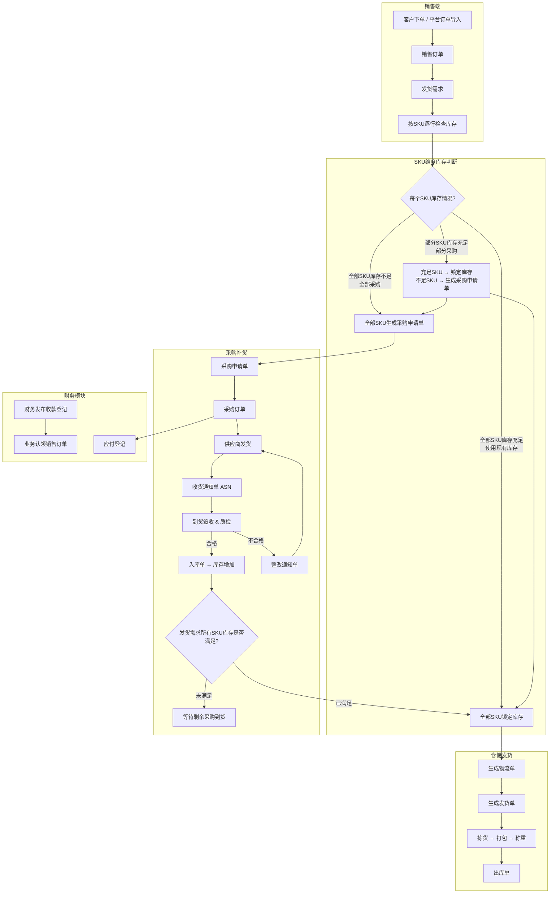

# 一、系统全局主流程

```mermaid
flowchart TB
    subgraph 销售端
        A1[客户下单 / 平台订单导入] --> A2[销售订单]
        A2 --> A3[发货需求]
        A3 --> A4[按SKU逐行检查库存]
    end

    subgraph SKU维度库存判断
        A4 --> A5{每个SKU库存情况?}
        A5 -->|全部SKU库存充足\n使用现有库存| B0[全部SKU锁定库存]
        A5 -->|全部SKU库存不足\n全部采购| D0[全部SKU生成采购申请单]
        A5 -->|部分SKU库存充足\n部分采购| M1[充足SKU → 锁定库存\n不足SKU → 生成采购申请单]
        M1 --> B0
        M1 --> D0
    end

    subgraph 仓储发货
        B0 --> B1[生成物流单]
        B1 --> B2[生成发货单]
        B2 --> B3[拣货 → 打包 → 称重]
        B3 --> B4[出库单]
    end

    subgraph 采购补货
        D0 --> D1[采购申请单]
        D1 --> D2[采购订单]
        D2 --> D3[供应商发货]
        D3 --> D4[收货通知单 ASN]
        D4 --> D5[到货签收 & 质检]
        D5 -->|合格| D7[入库单 → 库存增加]
        D5 -->|不合格| D8[整改通知单]
        D8 --> D3
        D7 --> D9{发货需求所有SKU库存是否满足?}
        D9 -->|已满足| B0
        D9 -->|未满足| D10[等待剩余采购到货]
    end

    subgraph 财务模块
        F1[财务发布收款登记] --> F2[业务认领销售订单]
        D2 --> F3[应付登记]
    end
```
