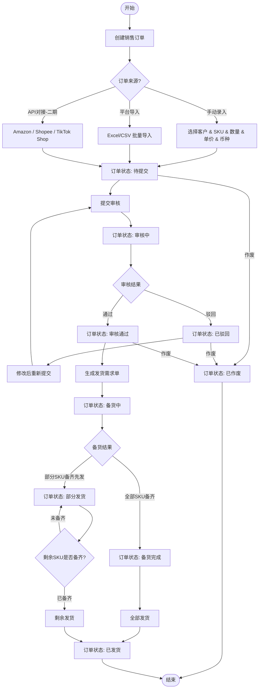

# 二、销售订单详细流程

```mermaid
flowchart TD
    S1([开始]) --> S2[创建销售订单]
    S2 --> S3{订单来源?}
    S3 -->|手动录入| S4[选择客户 & SKU & 数量 & 单价 & 币种]
    S3 -->|平台导入| S5[Excel/CSV 批量导入]
    S3 -->|API对接-二期| S6[Amazon / Shopee / TikTok Shop]

    S4 & S5 & S6 --> S7[订单状态: 待提交]
    S7 --> S8[提交审核]
    S8 --> S9[订单状态: 审核中]
    S9 --> S10{审核结果}
    S10 -->|驳回| S11[订单状态: 已驳回]
    S11 --> S12[修改后重新提交]
    S12 --> S8
    S10 -->|通过| S13[订单状态: 审核通过]

    S13 --> S14[生成发货需求单]
    S14 --> S15[订单状态: 备货中]
    S15 --> S16{备货结果}
    S16 -->|全部SKU备齐| S17[订单状态: 备货完成]
    S16 -->|部分SKU备齐先发| S18[订单状态: 部分发货]
    S17 --> S19[全部发货]
    S19 --> S20[订单状态: 已发货]
    S18 --> S21{剩余SKU是否备齐?}
    S21 -->|已备齐| S22[剩余发货]
    S22 --> S20
    S21 -->|未备齐| S18

    S7 -->|作废| S23[订单状态: 已作废]
    S11 -->|作废| S23
    S13 -->|作废| S23
    S23 --> S24([结束])
    S20 --> S24
```
