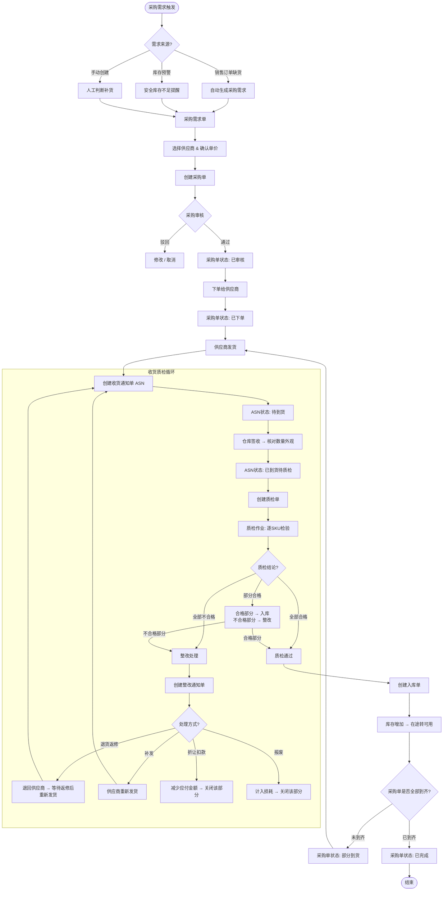

# 三、采购全流程（含质检整改循环）

```mermaid
flowchart TD
    P1([采购需求触发]) --> P2{需求来源?}
    P2 -->|销售订单缺货| P3[自动生成采购需求]
    P2 -->|库存预警| P4[安全库存不足提醒]
    P2 -->|手动创建| P5[人工判断补货]

    P3 & P4 & P5 --> P6[采购需求单]
    P6 --> P7[选择供应商 & 确认单价]
    P7 --> P8[创建采购单]
    P8 --> P9{采购审核}
    P9 -->|驳回| P10[修改 / 取消]
    P9 -->|通过| P11[采购单状态: 已审核]
    P11 --> P12[下单给供应商]
    P12 --> P13[采购单状态: 已下单]

    P13 --> P14[供应商发货]
    P14 --> P15[创建收货通知单 ASN]

    subgraph 收货质检循环
        P15 --> P16[ASN状态: 待到货]
        P16 --> P17[仓库签收 → 核对数量外观]
        P17 --> P18[ASN状态: 已到货待质检]
        P18 --> P19[创建质检单]
        P19 --> P20[质检作业: 逐SKU检验]
        P20 --> P21{质检结论?}

        P21 -->|全部合格| P22[质检通过]
        P21 -->|部分合格| P23[合格部分 → 入库 \n 不合格部分 → 整改]
        P21 -->|全部不合格| P24[整改处理]

        P23 -->|合格部分| P22
        P23 -->|不合格部分| P24

        P24 --> P25[创建整改通知单]
        P25 --> P26{处理方式?}
        P26 -->|退货返修| P27[退回供应商 → 等待返修后重新发货]
        P26 -->|补发| P28[供应商重新发货]
        P26 -->|折让扣款| P29[减少应付金额 → 关闭该部分]
        P26 -->|报废| P30[计入损耗 → 关闭该部分]

        P27 & P28 --> P15
    end

    P22 --> P31[创建入库单]
    P31 --> P32[库存增加 → 在途转可用]
    P32 --> P33{采购单是否全部到齐?}
    P33 -->|未到齐| P34[采购单状态: 部分到货]
    P34 --> P14
    P33 -->|已到齐| P35[采购单状态: 已完成]
    P35 --> P36([结束])
```
