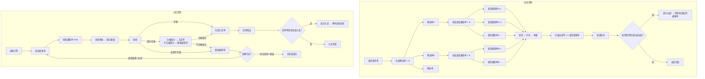

# 四、仓库作业流程（入库 & 出库）

```mermaid
flowchart TD
    subgraph 出库流程
        W1[发货需求单] --> W2[生成物流单 × N]
        W2 --> W3[物流单A]
        W2 --> W4[物流单B]
        W2 --> W5[物流单...]

        W3 --> W6[生成发货通知单 × N]
        W6 --> W7[发货通知单A-1]
        W6 --> W8[发货通知单A-2]
        W6 --> W9[发货通知单A-...]

        W4 --> W10[生成发货通知单 × N]
        W10 --> W11[发货通知单B-1]
        W10 --> W12[发货通知单B-...]

        W7 --> W13[拣货 → 打包 → 称重]
        W8 --> W13
        W9 --> W13
        W11 --> W13
        W12 --> W13

        W13 --> W14[生成出库单 1:1 发货通知单]
        W14 --> W15[扣减库存]
        W15 --> W16{发货需求是否全部出库?}
        W16 -->|否| W17[部分出库 → 等待后续发货通知单]
        W16 -->|是| W18[出库完成]
    end

    subgraph 入库流程
        R1[采购订单] --> R2[供应商发货]
        R2 --> R3[收货通知单 ASN]
        R3 --> R4[到货签收 → 核对数量]
        R4 --> R5[质检]
        R5 -->|合格| R6[生成入库单]
        R5 -->|部分合格| R7[合格部分 → 入库单\n不合格部分 → 整改通知单]
        R5 -->|全部不合格| R8[整改通知单]
        R7 -->|合格部分| R6
        R7 -->|不合格部分| R8
        R8 --> R9{处理方式?}
        R9 -->|退货返修 / 补发| R2
        R9 -->|折让扣款 / 报废| R10[关闭该部分]
        R6 --> R11[库存增加]
        R11 --> R12{采购单是否全部入库?}
        R12 -->|否| R13[部分入库 → 等待后续到货]
        R12 -->|是| R14[入库完成]
    end
```
