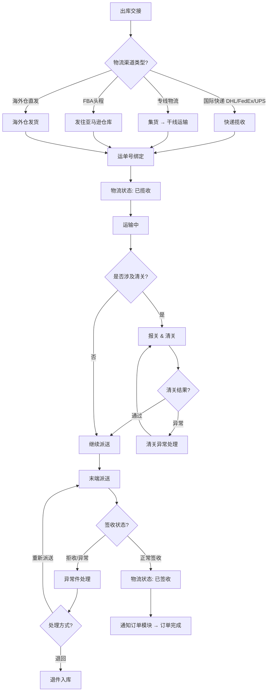

# 五、物流配送流程（前期先不做）

```mermaid
flowchart TD
    L1[出库交接] --> L2{物流渠道类型?}
    L2 -->|国际快递 DHL/FedEx/UPS| L3[快递揽收]
    L2 -->|专线物流| L4[集货 → 干线运输]
    L2 -->|FBA头程| L5[发往亚马逊仓库]
    L2 -->|海外仓直发| L6[海外仓发货]

    L3 & L4 & L5 & L6 --> L7[运单号绑定]
    L7 --> L8[物流状态: 已揽收]

    L8 --> L9[运输中]
    L9 --> L10{是否涉及清关?}
    L10 -->|是| L11[报关 & 清关]
    L11 --> L12{清关结果?}
    L12 -->|通过| L13[继续派送]
    L12 -->|异常| L14[清关异常处理]
    L14 --> L11
    L10 -->|否| L13

    L13 --> L15[末端派送]
    L15 --> L16{签收状态?}
    L16 -->|正常签收| L17[物流状态: 已签收]
    L16 -->|拒收/异常| L18[异常件处理]
    L18 --> L19{处理方式?}
    L19 -->|重新派送| L15
    L19 -->|退回| L20[退件入库]

    L17 --> L21[通知订单模块 → 订单完成]
```
