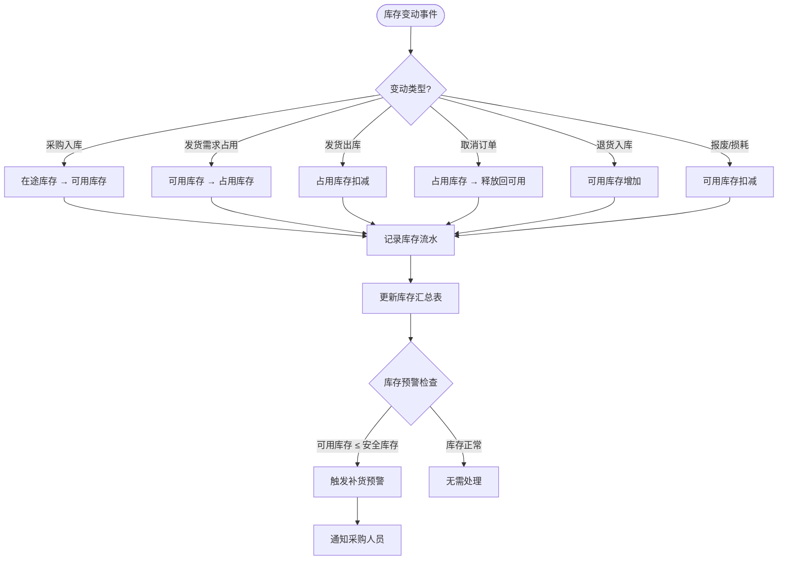

# 六、库存管理流程

```mermaid
flowchart TD
    I1([库存变动事件]) --> I2{变动类型?}

    I2 -->|采购入库| I3[在途库存 → 可用库存]
    I2 -->|发货需求占用| I4[可用库存 → 占用库存]
    I2 -->|发货出库| I5[占用库存扣减]
    I2 -->|取消订单| I6[占用库存 → 释放回可用]
    I2 -->|退货入库| I7[可用库存增加]
    I2 -->|报废/损耗| I8[可用库存扣减]

    I3 & I4 & I5 & I6 & I7 & I8 --> I9[记录库存流水]
    I9 --> I10[更新库存汇总表]

    I10 --> I11{库存预警检查}
    I11 -->|可用库存 ≤ 安全库存| I12[触发补货预警]
    I12 --> I13[通知采购人员]
    I11 -->|库存正常| I14[无需处理]
```
