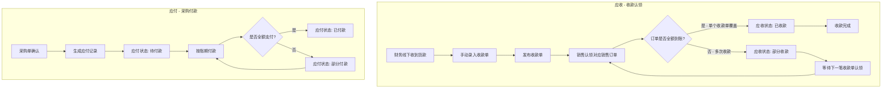

# 七、财务应收应付流程

```mermaid
flowchart TD
    subgraph 应收 - 收款认领
        F1[财务线下收到货款] --> F2[手动录入收款单]
        F2 --> F3[发布收款单]
        F3 --> F4[销售认领对应销售订单]
        F4 --> F5{订单是否全额到账?}
        F5 -->|是 - 单个收款单覆盖| F6[应收状态: 已收款]
        F5 -->|否 - 多次收款| F7[应收状态: 部分收款]
        F7 --> F8[等待下一笔收款单认领]
        F8 --> F4
        F6 --> F9[收款完成]
    end

    subgraph 应付 - 采购付款
        F10[采购单确认] --> F11[生成应付记录]
        F11 --> F12[应付状态: 待付款]
        F12 --> F13[按账期付款]
        F13 --> F14{是否全额支付?}
        F14 -->|是| F15[应付状态: 已付款]
        F14 -->|否| F16[应付状态: 部分付款]
        F16 --> F13
    end
```
