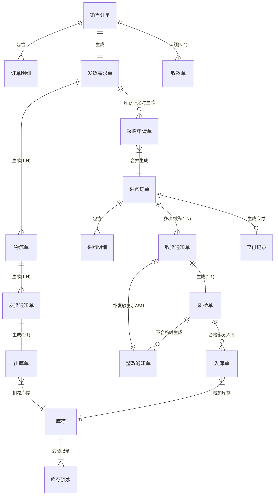

# 八、单据关联关系总览

```mermaid
erDiagram
    销售订单 ||--|{ 订单明细 : "包含"
    销售订单 ||--|| 发货需求单 : "生成"
    销售订单 ||--|{ 收款单 : "认领(N:1)"

    发货需求单 ||--|{ 物流单 : "生成(1:N)"
    物流单 ||--|{ 发货通知单 : "生成(1:N)"
    发货通知单 ||--|| 出库单 : "生成(1:1)"

    发货需求单 ||--o{ 采购申请单 : "库存不足时生成"
    采购申请单 }|--|| 采购订单 : "合并生成"
    采购订单 ||--|{ 采购明细 : "包含"
    采购订单 ||--|{ 收货通知单 : "多次到货(1:N)"
    收货通知单 ||--|| 质检单 : "生成(1:1)"
    质检单 ||--o{ 整改通知单 : "不合格时生成"
    整改通知单 ||--o| 收货通知单 : "补发触发新ASN"
    质检单 ||--o{ 入库单 : "合格部分入库"

    入库单 }|--|| 库存 : "增加库存"
    出库单 }|--|| 库存 : "扣减库存"
    库存 ||--|{ 库存流水 : "变动记录"

    采购订单 ||--o| 应付记录 : "生成应付"
```
