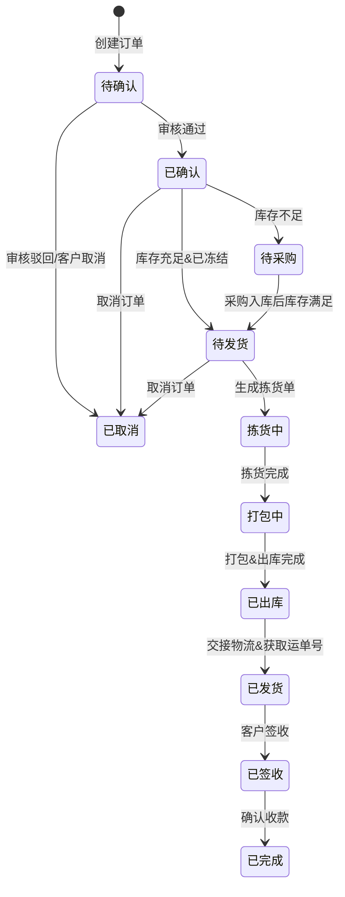

# 九、订单状态机

```mermaid
stateDiagram-v2
    [*] --> 待确认: 创建订单
    待确认 --> 已确认: 审核通过
    待确认 --> 已取消: 审核驳回/客户取消

    已确认 --> 待发货: 库存充足&已冻结
    已确认 --> 待采购: 库存不足
    待采购 --> 待发货: 采购入库后库存满足

    待发货 --> 拣货中: 生成拣货单
    拣货中 --> 打包中: 拣货完成
    打包中 --> 已出库: 打包&出库完成
    已出库 --> 已发货: 交接物流&获取运单号

    已发货 --> 已签收: 客户签收
    已签收 --> 已完成: 确认收款

    已确认 --> 已取消: 取消订单
    待发货 --> 已取消: 取消订单
```
