# TradeFlow ERP 核心业务流程图

> 来源：旧系统（宜搭 ERP）流程梳理，供新系统产品设计参考。

```mermaid
---
config:
  layout: elk
---
flowchart TD
    Start([开始])
    End([流程结束])

    %% ========== 外部系统：CRM ==========
    subgraph CRMSystem["外部系统：CRM（线索→商机→报价→销售合同）"]
        CRMLead["🧲 CRM线索"]
        CRMOpportunity["🧲 CRM商机"]
        CRMQuote["🧲 CRM报价单"]
        CRMContract["🧲 CRM销售合同"]

        CRMLead --> CRMOpportunity
        CRMOpportunity --> CRMQuote
        CRMQuote --> CRMContract
    end

    %% ========== 外部系统：售后管理 ==========
    subgraph AfterSalesSystem["外部系统：售后管理（报修→工单→处理→确认）"]
        AfterSalesConsult["🧲 客户报修/咨询"]
        AfterSalesTicket["🧲 生成售后工单"]
        AfterSalesDispatch["🧲 派单/处理进度"]
        AfterSalesConfirm["🧲 处理结果确认"]

        AfterSalesConsult --> AfterSalesTicket
        AfterSalesTicket --> AfterSalesDispatch
        AfterSalesDispatch --> AfterSalesConfirm
    end

    subgraph ERPSystem["内部系统：ERP（核心业务流程）"]
        %% ========== ① 销售流程（ERP） ==========
        subgraph SalesFlow["① 销售流程（ERP）"]
            SO["📋 创建销售订单"]
            SO --> SOOA{销售订单<br/>OA审批}
        end

        %% ========== ② 售后流程 ==========
        subgraph AfterSalesFlow["② 售后流程（ERP）"]
            AfterSO["📋 创建售后单"]
            AfterSO --> ASOOA{售后单<br/>OA审批}
        end

        %% ========== ③ 样机订单流程 ==========
        subgraph ProtoFlow["③ 样机订单流程（ERP）"]
            ProtoReqInfo["📝 海外参展等需要样机申请<br/>(需包含后续是否退回)"] -.-> ProtoApp["📋 创建样机申请"]

            ProtoApp --> PAOA{样机申请<br/>OA审批}

            PAOA -->|通过| ProtoDecision{是否有<br/>可销售产品?}
            ProtoDecision -->|是| ProtoToSO["➡️ 部分产品下推<br/>到销售订单"]
            ProtoToSO --> SO
            ProtoDecision -->|否| ProtoPass["继续样机流程"]

        end

        %% ========== ④ 备货流程 ==========
        subgraph StockFlow["④ 备货流程（线下需求→采购）"]
            StockApp["📊 基于备货需求"]
        end

        %% ========== ⑤ 商务履约流程 ==========
        subgraph BusinessPhase["⑤ 商务判断采购数量"]
            GenShip["📋 创建发货需求单"] --> ProcReq{🤔商务判断<br/>有可用库存?}

            %% 有库存分支
            ProcReq -->|有库存| OccupyStock["👤 占用库存<br/>锁定部分库存"]

            %% 无库存或库存不足分支
            ProcReq -->|无库存/<br/>库存不足| RPOAction["👤 发起采购申请<br/>采购缺少部分"]

            %% 并行：库存充足后创建完整发货计划
            OccupyStock -.->|基于已占用库存| ShipPlan["📋 发货计划"]
            RPOAction -.->|采购到货后| ShipPlan

            SOOA -->|通过| GenShip
            ASOOA -->|通过| GenShip
            ProtoPass --> GenShip
        end

        %% ========== ⑥ 采购流程 ==========
        subgraph PurchasePhase["⑥ 采购流程"]
            RPO["📋 发起采购申请"]
            Product["📊 产品资料库"]
            AssignProc["👤 采购团队分配跟单"]
            SplitPO["⚙️ 系统拆分生成采购订单<br/>(根据供应商+跟单分组)"]
            PO["📋 采购订单"]
            Contract["📋 生成采购合同"]
            ESeal["👤 电子签章"]
            PrePayDecision{是否<br/>预付?}

            RPOAction --> RPO
            Product -->|产品默认跟单与供应商| AssignProc
            RPO --> AssignProc
            AssignProc --> SplitPO
            SplitPO --> PO
            PO --> Contract
            ESeal --> Contract
            Contract --> PrePayDecision

            StockApp --> RPO
        end

        %% ========== ⑦ 收货与质检流程 ==========
        subgraph ReceiveQCPhase["⑦ 收货与质检"]
            RN["📋 收货通知单"]
            QC["👤 质检整改清点<br/>填写合格/不合数量、体积"]
            QCResult{质检<br/>结果}
            GenIN["📝 采购入库单"]
            BaseOnShipDecision{是否基于<br/>发货需求?}
            LockStock["⚙️ 系统自动锁定库存<br/>到发货计划"]
            Return["👤 采购退货"]
            POEnd["⚙️ 系统采购单完结"]

            Contract --> RN
            RN --> QC
            QC --> QCResult
            QCResult -->|通过| GenIN
            POEnd --> BaseOnShipDecision
            BaseOnShipDecision -->|是| LockStock

            QCResult -->|不通过| Return
            Return -.->|重新补发| RN
            GenIN --> POEnd
        end

        %% ========== ⑧ 采购付款 ==========
        subgraph PaymentPhase["⑧ 采购付款"]
            PayPlan["📋 生成付款计划"]
            PayPlan --> POPayApp["📋 创建付款申请"]

            PrePayDecision -->|是| PayPlan
            POEnd -->|非预付款| PayPlan
        end

        %% ========== ⑨ 内销物流流程 ==========
        subgraph DomesticLogisPhase["⑨ 内销物流流程"]
            ShipPlan --> DomesticLogisOrder["📋 内销物流单"]
            DomesticLogisOrder --> DomesticCourierInfo["📋 快递信息"]
            DomesticCourierInfo --> DomesticTrack["👤 内销物流跟进/签收"]
            DomesticLogisOrder --> DomesticSchedule["👤 确认快递/到仓时间"]
        end

        %% ========== ⑩ 外销物流流程 ==========
        subgraph ExportLogisPhase["⑩ 外销物流流程"]
            ShipPlan --> ExportLogisOrder["📋 外销物流单"]
            ExportLogisOrder --> Booking["👤 线下订舱"]
            Note1["💡 现状点:<br/>需要等齐套后再订舱"] --> Booking
            Booking --> ExportSchedule["👤 船期/截关计划确认"]
            ExportSchedule --> ExportDocs["📋 报关资料/发运信息"]
            ExportDocs --> ExportCustoms["📋 生成报关单"]
            ExportCustoms --> CustomsCompleted{报关<br/>完成?}
            CustomsCompleted --> TrackDeliver["👤 离港/到港/签收跟进"]
        end

        %% ========== ⑪ 仓库执行 ==========
        subgraph ShipExecutePhase["⑪ 仓库执行"]
            DomesticSchedule --> ShipNotice["📋 发货通知单"]
            ExportSchedule --> ShipNotice
            ShipNotice --> WHMeasure["👤 仓库登记件/重/尺"]
            WHMeasure -.-> ExportDocs
            WHMeasure --> StockCheck["⚙️ 系统检查库存"]
            StockCheck --> InlandOut["📋 仓库出库单（销售/样机/售后）"]
            InlandOut --> GenOutDetail["⚙️ 系统扣减库存"]
        end

        %% ========== ⑫ 调拨流程 ==========
        subgraph ReallocPhase["⑫ 调拨流程"]
            ReallocDecision{是否<br/>调拨?}
            CreateAlloc["📋 创建调拨单"]
            AllocOut["👤 调拨出库"]
            Receipt["⚙️ 系统收货"]

            ShipPlan --> ReallocDecision
            ReallocDecision -->|是| CreateAlloc
            ReallocDecision -->|否| Receipt
            CreateAlloc --> AllocOut
            AllocOut --> Receipt
            Receipt -.-> StockCheck
        end

        %% ========== ⑬ 物流费用与付款 ==========
        subgraph LogisticsPayPhase["⑬ 物流费用与付款"]
            DomesticCourierInfo --> ActualFee["👤 录入物流费用项"]
            ExportDocs --> ActualFee
            ActualFee --> LogisPayApp["📋 创建付款申请"]
        end

        %% ========== ⑭ 开票流程 ==========
        subgraph InvoicePhase["⑭ 开票流程"]
            Invoice["📋 创建开票申请"]
            Upload["👤 上传发票"]
            Verify["👤 发票验真与核对"]

            POEnd --> Invoice
            Invoice --> Upload
            Upload --> Verify
        end

        %% ========== 流程结束 ==========
        TrackDeliver --> End
        DomesticTrack --> End
    end

    AfterSalesDispatch LineCMASO@--> AfterSO
    CRMContract LineCRMSO@--> SO

    Start --> SO
    Start --> AfterSO
    Start --> ProtoApp
    Start --> StockApp

    %% ========== 外部系统：合思费控 ==========
    subgraph HeSiSystem["外部系统：合思费控"]
        HSPayAppPO["🧲 付款申请单（采购付款）合思"]
        HSPayAppLogis["🧲 付款申请单（物流费用付款）合思"]

        HSPayAudit["👤 付款申请审批处理"]

        HSPayOrder["🧲 付款单"]

        POPayApp LineHSPO@--> HSPayAppPO
        LogisPayApp LineHSLogis@--> HSPayAppLogis

        HSPayAppPO --> HSPayAudit
        HSPayAppLogis --> HSPayAudit
        HSPayAudit --> HSPayOrder
    end

    %% ========== 样式定义 ==========
    classDef Document fill:#FFE082,stroke:#EF6C00,stroke-width:3px
    class SO,AfterSO,ProtoApp,GenShip,RPO,PO,Contract,PayPlan,RN,ShipPlan,DomesticLogisOrder,ExportLogisOrder,ShipNotice,InlandOut,GenOutDetail,DomesticCourierInfo,ExportDocs,ExportCustoms,CreateAlloc,POPayApp,LogisPayApp,Invoice,GenIN Document

    classDef Decision fill:#FFF9C4,stroke:#F57F17,stroke-width:2px
    class SOOA,ASOOA,PAOA,PrePayDecision,QCResult,SaleTypeDecision,CustomsCompleted,ReallocDecision,ProtoDecision,BaseOnShipDecision Decision

    classDef SystemOp fill:#E3F2FD,stroke:#1565C0,stroke-width:2px
    class SplitPO,LockStock,POEnd,GenOutDetail,Receipt,StockCheck SystemOp

    classDef UserAction fill:#FCE4EC,stroke:#AD1457,stroke-width:2px
    class ProtoToSO,RPOAction,OccupyStock,AssignProc,ESeal,QC,Return,DomesticSchedule,ExportSchedule,WHMeasure,DomesticTrack,InlandTrack,TrackDeliver,ActualFee,Upload,Verify UserAction

    classDef OfflineDecision fill:#EDE7F6,stroke:#5E35B1,stroke-width:2px
    class ProcReq,StockApp,ProtoReqInfo,Product OfflineDecision

    classDef InfoNote fill:#F5F5F5,stroke:#616161,stroke-width:1.5px
    class GetBoxInfo,Note1 InfoNote

    classDef OfflineAction fill:gray,stroke:#616161,stroke-width:1.5px
    class Booking OfflineAction

    classDef ExternalSystem fill:#FAFAFA,stroke:#9E9E9E,stroke-dasharray:4 3,stroke-width:1.5px,color:#5F6368
    class CRMLead,CRMOpportunity,CRMQuote,CRMContract,AfterSalesConsult,AfterSalesTicket,AfterSalesDispatch,AfterSalesConfirm,HSPayAppPO,HSPayAppLogis,HSPayAudit,HSPayOrder ExternalSystem

    style Start fill:#A5D6A7,stroke:#1B5E20,stroke-width:2px
    style End fill:#F48FB1,stroke:#880E4F,stroke-width:2px

    style CRMSystem fill:#FFF8E1,stroke:#FB8C00,stroke-width:2px,stroke-dasharray:4 3
    style ERPSystem fill:#E3F2FD,stroke:#1565C0,stroke-width:2px
    style HeSiSystem fill:#F1F8E9,stroke:#43A047,stroke-width:2px,stroke-dasharray:4 3
    style AfterSalesSystem fill:#AED581,stroke:#EF6C00,stroke-width:2px,stroke-dasharray:4 3

    classDef ExtLineAnimate stroke:orange,stroke-dasharray: 9,5,stroke-dashoffset: 900,animation: dash 25s linear infinite;
    class LineCMASO,LineCRMSO,LineHSPO,LineHSLogis ExtLineAnimate
```

## 流程节点图例

| 颜色 | 含义 |
|------|------|
| 琥珀色（橙边）| 单据类节点（销售订单、采购订单、发货通知单等） |
| 黄色菱形 | 决策/审批节点 |
| 天蓝色 | 系统自动执行操作 |
| 粉色 | 线上用户操作 |
| 淡紫色 | 线下商务判断/产品资料 |
| 灰色 | 线下动作（如订舱） |
| 虚线框节点 | 外部系统引用（CRM、售后、合思费控） |

## 主要流程分支说明

| 编号 | 流程模块 | 触发条件 |
|------|---------|---------|
| ① | 销售流程 | CRM 合同签订后推送，或手动创建 |
| ② | 售后流程 | 售后工单派单后触发 |
| ③ | 样机申请 | 海外参展等场景手动发起 |
| ④ | 备货流程 | 线下需求判断后发起采购申请 |
| ⑤ | 商务履约 | 销售/售后/样机审批通过后创建发货需求单 |
| ⑥ | 采购流程 | 库存不足时发起采购申请 |
| ⑦ | 收货质检 | 采购合同签订后生成收货通知单 |
| ⑧ | 采购付款 | 预付款在合同后；尾款在采购单完结后 |
| ⑨ | 内销物流 | 发货计划确认后 |
| ⑩ | 外销物流 | 发货计划确认后，线下订舱 |
| ⑪ | 仓库执行 | 物流计划确认后生成发货通知单，仓库出库 |
| ⑫ | 调拨流程 | 发货计划触发，判断是否需要跨仓调拨 |
| ⑬ | 物流费用 | 物流信息录入后发起付款申请推合思 |
| ⑭ | 开票流程 | 采购单完结后创建开票申请 |
